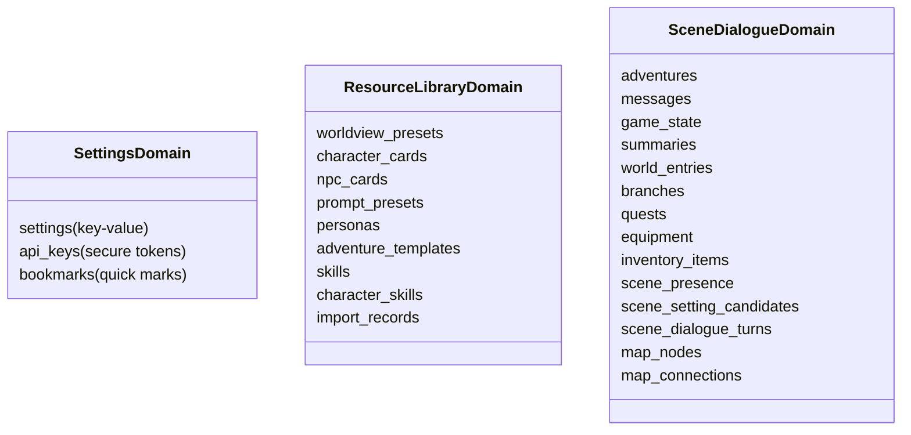

# 阶段二：数据持久化与仓库层移植计划

> **文档编号**：`02_PHASE_PERSISTENCE_SERVICES`  
> **当前状态**：✅ **已完成 (Completed)**  
> **前置依赖**：`01_PHASE_INFRASTRUCTURE`  
> **预计成果**：构建精简可控的 SQLite 数据库 `DatabaseService`，实现四大核心 Repository 接口及实现，提供 API 密钥安全加密存储机制。

---

## 1. 本阶段目标

1. 提取并重构主库 `DatabaseService`（`adventures.db`），只保留**设置**、**资料库**和**场景对话**所必须的数据表与 DDL 语句，彻底剥离原项目中 10+ 个长篇创作（Creation）和 Naila 向量表。
2. 移植桌面端与移动端双适配的 SQLite FFI 初始化与连接管理。
3. 移植敏感数据安全存储模块 `KeyVault`（基于 `flutter_secure_storage`）。
4. 移植四大核心仓库契约接口与实现：`SettingsRepository`、`LibraryRepository`、`AdventureRepository`、`WorldEntryRepository`。

---

## 2. 数据库 Schema 架构与保留表清单

### 2.1 保留的 SQLite 数据表分类

### 2.2 剥离与剔除的表（Decoupled Tables）
- `creation_library_resources` / `creation_library_relations` / `creation_library_imports`
- `creation_projects` / `creation_chapters` / `creation_volumes` / `creation_nodes`
- `creation_agent_runs` / `creation_agent_checkpoints` / `creation_outbox`
- `naila_assistant.db` 整体库（包含向量分块、知识图谱与助手对话）

---

## 3. 待迁移与重构文件清单

| 目标文件 | 源文件 (`~/NarrAItor/`) | 职责说明与裁剪要点 |
| :--- | :--- | :--- |
| `lib/services/database_service.dart` | `lib/services/database_service.dart` | **重点重构**：移除 `CreationDatabaseService` 引用，清理迁移历史，整合为一个统一的 v1 DDL 初始化脚本；保留 DB 锁与重试策略。 |
| `lib/services/key_vault.dart` | `lib/services/key_vault.dart` | 负责 API 密钥的多平台加密存取 |
| `lib/services/auto_backup_service.dart` | `lib/services/auto_backup_service.dart` | 数据库自动备份与恢复服务（可选安全增强） |
| `lib/services/repositories/settings_repository.dart` | `lib/services/repositories/settings_repository.dart` | 设置项数据访问接口声明 |
| `lib/services/repositories/settings_repository_impl.dart` | `lib/services/repositories/settings_repository_impl.dart` | 设置持久化操作实现（增删改查设置键值） |
| `lib/services/repositories/library_repository.dart` | `lib/services/repositories/library_repository.dart` | 资料库数据访问接口声明 |
| `lib/services/repositories/library_repository_impl.dart` | `lib/services/repositories/library_repository_impl.dart` | 世界观预设、角色卡、NPC 等实体的数据库操作 |
| `lib/services/repositories/adventure_repository.dart` | `lib/services/repositories/adventure_repository.dart` | 冒险对话、消息、游戏状态、任务、装备的访问接口 |
| `lib/services/repositories/adventure_repository_impl.dart` | `lib/services/repositories/adventure_repository_impl.dart` | 核心：包含 `commitSceneDialogueTurn` 事务落库逻辑 |
| `lib/services/repositories/world_entry_repository.dart` | `lib/services/repositories/world_entry_repository.dart` | 场景内动态词条/世界观词条存储接口 |
| `lib/services/repositories/world_entry_repository_impl.dart` | `lib/services/repositories/world_entry_repository_impl.dart` | 世界条目的 CRUD 与基于冒险 ID 检索 |

---

## 4. 实施要点与关键代码设计

### 4.1 精简版 `DatabaseService` 初始化策略
- 采用直接 DDL 建立完整表结构，避免执行源工程从 v1 到 v25 的漫长历史迁移循环。
- 保留外键支持：`PRAGMA foreign_keys = ON`。
- 保留 WAL 模式：`PRAGMA journal_mode = WAL` 提升并发读写性能。
- 确保静态单例与测试目录重定向（`customDbDir`）保留，以便进行独立的自动化单元测试。

### 4.2 `KeyVault` 安全存储机制（直接移植自 `~/NarrAItor/lib/services/key_vault.dart`）
源工程中的 `KeyVault` 是一个基于开源密码学算法的完整企业级加密库（191 行），而非简易包装：
- **加密核心**：AES-256-CBC（FIPS 197 / NIST SP 800-38A）与 PKCS7 Padding。
- **密钥派生**：PBKDF2-HMAC-SHA256（10000 次迭代，加盐 + 嵌入式 `_appPepper` 混淆）。
- **完整性校验**：HMAC-SHA256 签名附加在密文末尾，解密前强校验。
- **持久化载体**：加密后的密文存储在 SQLite 主库的 `api_keys` 表（字段：`provider_type`, `key_hash`, `encrypted_key`, `salt`, `iv`, `auth_tag`, `updated_at`），内存中绝不常驻明文。
- **移植策略**：无需重写或简化，直接移植完整文件，配合 `pubspec.yaml` 中引入的 `pointycastle: ^4.0.0` 即可完全无损运行。

---

## 5. 验收标准 (Acceptance Criteria)

- [x] 编写并执行 SQLite 基础测试脚本，成功在内存/临时目录创建数据库并生成所有核心表。
- [x] `SettingsRepositoryImpl` 成功执行设置键值读写。
- [x] `LibraryRepositoryImpl` 成功插入并查询一张角色卡与一个世界观预设。
- [x] `AdventureRepositoryImpl` 成功创建一条冒险记录、插入消息并完成基础事务提交。
- [x] 执行 `git commit -m "feat(storage): implement DatabaseService, KeyVault, and repositories"` 归档。
