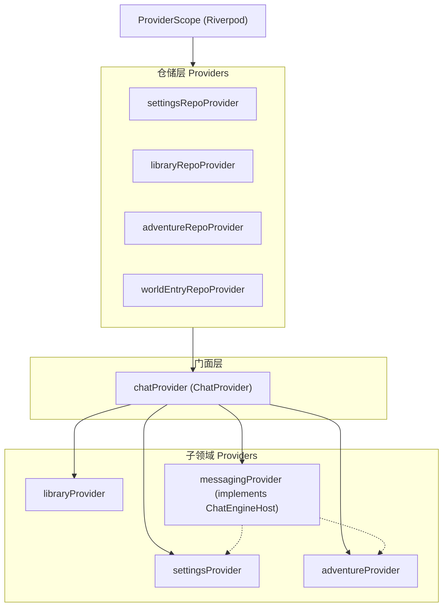

# 阶段四：状态管理与业务控制器移植计划

> **文档编号**：`04_PHASE_PROVIDERS_CONTROLLERS`  
> **当前状态**：✅ **已完成 (Completed)**  
> **前置依赖**：`03_PHASE_MODELS_ENGINES`  
> **预计成果**：实现解耦后的 Riverpod 3.x 依赖注入树，完成 1 个门面 Facade + 4 个子领域 Provider 的构建，实现业务控制器与 UI 层的解耦驱动。

---

## 1. 本阶段目标

1. 重构并精简跨模块状态门面 `ChatProvider`（Facade 模式），剔除原项目中 30% 以上的 Naila 助手与创作模式桥接代码。
2. 移植 4 个子 Provider：`SettingsProvider`、`AdventureProvider`、`LibraryProvider`、`MessagingProvider`（实现 `ChatEngineHost` 接口）。
3. 构建 `riverpod_providers.dart`，负责统一实例化各 Repository 并注册 Provider 依赖树。
4. 移植设置与资料库业务控制器（`ModelSettingsController`、`ResourceCrudController`）。

---

## 2. 状态分层与架构拓扑

---

## 3. 待迁移与重构文件清单

| 目标文件 | 源文件 (`~/NarrAItor/`) | 职责与裁剪要点 |
| :--- | :--- | :--- |
| `lib/providers/settings_provider.dart` | `lib/providers/settings_provider.dart` | 管理 API 密钥缓存、当前模型提供商、生成参数、暗黑主题切换、TTS 语音等 |
| `lib/providers/library_provider.dart` | `lib/providers/library_provider.dart` | 管理资料库列表缓存、预设筛选、角色卡增删改查通知 |
| `lib/providers/adventure_provider.dart` | `lib/providers/adventure_provider.dart` | 管理当前活跃冒险、消息列表、游戏数值状态、世界词条列表 |
| `lib/providers/messaging_provider.dart` | `lib/providers/messaging_provider.dart` | **核心桥梁**：实现 `ChatEngineHost` 接口，持有着 `ChatEngine` 实例并转发打字机更新 |
| `lib/providers/chat_provider.dart` | `lib/providers/chat_provider.dart` | **重点重构**：统一暴露四大子模块状态，完全移除对 `creation_*` 和 `assistant_*` 的委托与通知 |
| `lib/providers/riverpod_providers.dart` | `lib/providers/riverpod_providers.dart` | Riverpod 注册入口：提供类型安全的 `Provider<IRepository>` 和 `ChangeNotifierProvider` |
| `lib/controllers/model_settings_controller.dart` | `lib/controllers/model_settings_controller.dart` | 设置页面业务控制器：连接测试、保存配置 |
| `lib/controllers/resource_crud_controller.dart` | `lib/controllers/resource_crud_controller.dart` | 资料库卡片创建、编辑草稿、保存回写控制器 |
| `lib/application/llm/model_settings_use_case.dart` | `lib/application/llm/model_settings_use_case.dart` | 模型设置校验与网络测试用例 |

---

## 4. 关键实现与解耦要点

### 4.1 `MessagingProvider` 宿主实现（直接复用 `~/NarrAItor/lib/providers/messaging_provider.dart`）
源工程中的 `MessagingProvider` 已经完整实现了 `ChatEngineHost` 接口（290 行），无需手写简化逻辑：
- **依赖注入**：通过 `setHostProviders(settings, adventure, library)` 注入另外三个子 Provider 引用。
- **契约托管**：其内部的 25+ 个 getter（如 `apiKey`, `apiBaseUrl`, `modelName`, `dialogueLevel` 委托给 `_settingsProv`；`messages`, `currentAdventureId` 委托给 `_adventureProv`；`worldEntries` 委托给 `_adventureProv` 等）全部为强类型无闭包委托。
- **子管理器聚合**：持有并初始化 `ChatEngine`、`TokenManager`、`SearchManager`、`BookmarkManager`、`EmotionManager`、`MultiCharManager`。
- **移植策略**：直接迁移源文件，并在本次移植的精简版 `riverpod_providers.dart` 中由 `chatProvider` 统一通过 `withRepos` 完成组装。

### 4.2 `ChatProvider` 精简瘦身
原 `ChatProvider` 包含了长篇写作与 Naila 相关的上百行代理方法（如 `openCreationProject`、`requestAssistantTurn` 等）。在本次移植中：
- 仅保留 `currentSection`（导航分区：`adventure`, `resources`, `settings`）。
- 仅保留冒险生命周期（`startAdventureWithConfig`, `openAdventure`, `closeAdventure`）。
- 仅保留对 `settingsProvider`, `adventureProvider`, `libraryProvider`, `messagingProvider` 的直接访问。

---

## 5. 验收标准 (Acceptance Criteria)

- [x] `ProviderContainer` 能够在无 UI 界面环境下成功初始化并解析所有 Provider。
- [x] 调用 `chatProvider.settingsProvider.setApiKey(...)` 能触发状态更新与持久化保存。
- [x] 调用 `chatProvider.libraryProvider.createCharacterCard(...)` 能够正常写库并更新内存列表。
- [x] 状态机并发控制有效：在一次生成过程中多次调用 `sendMessage` 会正确被拦截守卫拦截。
- [x] 执行 `git commit -m "feat(state): integrate Riverpod providers, ChatEngineHost, and controllers"` 归档。

---

## 6. 完成状态 (Completion Status)

- **状态**: ✅ 已完成 (Completed)
- **验证测试**: `test/unit/riverpod_and_providers_test.dart` (5/5 测试全部通过，总计 24/24 自动化测试全绿)
- **代码分析**: `flutter analyze` (0 errors, 0 warnings)
