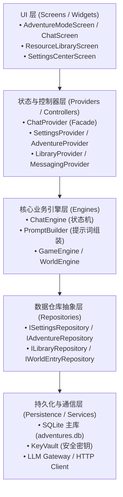

# NarrAItor 核心模块移植计划 (Migration Plan)

> **目标**：将 `~/NarrAItor` 项目中的**场景对话 (Scene Dialogue)**、**资料库 (Resource Library)** 与 **设置 (Settings)** 三大核心功能模块精准移植到当前仓库 (`/home/yrz/LT`)，形成高内聚、低耦合、开箱即用的沉浸式 AI 对话与世界观管理应用。

---

## 一、移植目标与范围定义

### 1.1 核心移植模块

| 模块名称 | 核心职责 | 主要包含功能 |
| :--- | :--- | :--- |
| **设置 (Settings)** | 全局配置与模型接入 | 多 LLM 服务商接入配置（DeepSeek、Qwen、OpenAI、Ollama 等）、安全密钥保管（KeyVault）、对话参数配置（温度、TopP、最大Token）、主题模式与通用偏好。 |
| **资料库 (Resource Library)** | 世界观与设定管理 | 世界观预设（Worldview Presets）、角色卡（Character Cards）、NPC 档案、提示词预设（Prompt Presets）、人设化身（Personas）、技能（Skills）、模板以及导入/导出。 |
| **场景对话 (Scene Dialogue)** | 剧情驱动与状态流转 | 冒险生命周期管理、双段响应（正文+结构化JSON）状态机、轻量滑动窗口与摘要服务、剧情副作用原子落库、游戏状态（数值/物品/好感度/任务）、交互式选项输入与打字机动效。 |
| **支撑基建 (Core / Infrastructure)** | 底层运行时与依赖注入 | Riverpod 3.x 全局容器、SQLite 主库持久化（`DatabaseService`）、基础主题/色彩体系、网络与通用工具组件。 |

### 1.2 剥离与排除模块（Decoupled Scope）

为保持本仓库架构清晰精简，以下独立且高度复杂的附属子系统在此次移植中予以剔除：
- **奈拉 AI 助手系统 (Naila Assistant & Memory)**：`naila_assistant.db`、`naila_knowledge` 向量检索体系（RAG 混合检索、分块与背景 Worker）。
- **长篇创作工作流 (Creation Mode V2)**：长篇小说分卷大纲管线、小说字数分配器（Scale Policy）、创作 Agent 运行时与崩溃恢复机制（`CreationAgentRuntime`、`CreationCommitCoordinator`）。

---

## 二、目标架构与分层设计

移植后的应用遵循清晰的五层分层架构，去除了上帝类与不必要的耦合：



---

## 三、分阶段移植详细步骤 (Step-by-Step Implementation)

### 阶段一：工程基建与依赖初始化 (Infrastructure & Dependencies)

> **状态**：✅ **已完成 (Completed)**（提交哈希：`859560e`）

#### 1. 目标
搭建标准 Flutter 工程基础，配置 `pubspec.yaml` 并拉取必要依赖，拷贝核心基础工具库。

#### 2. 待移植文件清单
- `pubspec.yaml`
- `lib/core/theme/`（`app_theme.dart`, `app_colors.dart`）
- `lib/core/feedback/`（`app_feedback.dart`）
- `lib/core/errors/`（基础异常模型）
- `lib/core/utils/`（通用字符串、时间格式化等）
- `assets/`（必须的基础矢量图标与字体资源）

#### 3. 执行要点
1. 生成精简版 `pubspec.yaml`，仅保留核心依赖：
   - `flutter_riverpod: ^3.3.2`
   - `sqflite: ^2.3.0` & `sqflite_common_ffi: ^2.3.0`
   - `path: ^1.9.0` & `path_provider: ^2.1.0`
   - `flutter_secure_storage: ^10.2.0`
   - `shared_preferences: ^2.2.0`
   - `http: ^1.2.0`
   - `flutter_markdown_plus: ^1.0.7`
   - `google_fonts: ^8.2.1`
2. 运行 `flutter pub get` 安装所有依赖包。

---

### 阶段二：数据持久化与安全存储层 (Persistence & Storage)

> **状态**：✅ **已完成 (Completed)**（提交哈希：`eee8acf`）

#### 1. 目标
建立主数据库与敏感数据存储机制，建立 Repository 接口规范。

#### 2. 待移植文件清单
- **数据库服务**：
  - `lib/services/database_service.dart`（移除 Naila/Creation 专用表与迁移，保留 settings, character_cards, worldview_presets, prompt_presets, personas, adventures, messages, game_state, summaries, branches, quests 等核心表）
- **安全存储**：
  - `lib/services/key_vault.dart`
- **仓库接口与实现**：
  - `lib/services/repositories/settings_repository.dart` & `settings_repository_impl.dart`
  - `lib/services/repositories/library_repository.dart` & `library_repository_impl.dart`
  - `lib/services/repositories/adventure_repository.dart` & `adventure_repository_impl.dart`
  - `lib/services/repositories/world_entry_repository.dart` & `world_entry_repository_impl.dart`

#### 3. 执行要点
1. 审查 `DatabaseService` 中的 SQLite 表结构，确保表迁移脚本兼容单次干净初始化。
2. 配置桌面端 SQLite FFI 初始化（Linux/macOS/Windows `sqfliteFfiInit`）。

---

### 阶段三：领域模型与业务逻辑引擎 (Domain Models & Engines)

> **状态**：✅ **已完成 (Completed)**（提交哈希：`abc0187`）

#### 1. 目标
迁移场景对话运转和资料库存储所需的全部领域数据模型，以及对话状态机核心引擎。

#### 2. 待移植文件清单
- **模型层 (`lib/models/`)**：
  - `message.dart`（消息与气泡契约）
  - `game_state.dart`、`combat_state.dart`、`quest.dart`、`equipment.dart`（游戏动态数据）
  - `scene_dialogue.dart`、`scene_dialogue_effects.dart`、`dialogue_level.dart`（场景对话契约）
  - `character_card.dart`、`worldview_preset.dart`、`prompt_preset.dart`、`persona.dart`、`skill.dart`（资料库实体）
  - `llm_provider.dart`、`completion_params.dart`、`adventure_config.dart`、`model_context_capability.dart`（模型配置）
- **引擎层 (`lib/engines/`)**：
  - `chat_engine.dart`（对话核心调度与生命周期状态机）
  - `chat_engine_host.dart`（宿主交互接口）
  - `chat_engine_internals/prompt_builder.dart`（提示词组装与上下文窗口）
  - `chat_engine_internals/stream_handler.dart`（打字机流式解析）
  - `chat_engine_internals/summary_service.dart`（事件时间线滚动摘要）
  - `game_engine.dart` & `world_engine.dart`
- **网络与通信 (`lib/services/`)**：
  - `llm_service.dart`（模型 API 调用通信网关）

#### 3. 执行要点
1. 保持 `ChatEngine` 的首行并发守卫与状态流转机制完整。
2. 保持原子提交 `commitSceneDialogueTurn` 事务性，确保模型异常时回退。

---

### 阶段四：状态管理与控制器层 (Providers & Controllers)

> **状态**：✅ **已完成 (Completed)**（提交哈希：`12c8400`）

#### 1. 目标
构建 Riverpod 状态树与业务控制器，提供清晰的状态下发与更新入口。

#### 2. 待移植文件清单
- `lib/providers/chat_provider.dart`（跨模块 Facade 门面）
- `lib/providers/settings_provider.dart`（设置领域状态）
- `lib/providers/library_provider.dart`（资料库领域状态）
- `lib/providers/adventure_provider.dart`（冒险对话与游戏状态）
- `lib/providers/messaging_provider.dart`（消息收发与打字机桥接）
- `lib/providers/riverpod_providers.dart`（全局 Provider 注册与装配）
- `lib/controllers/model_settings_controller.dart`
- `lib/controllers/resource_crud_controller.dart`

#### 3. 执行要点
1. 裁剪 `ChatProvider` 中与创作模式、Naila 助手的跨层引用，将其收敛为三模块状态中心。
2. 确保 `riverpod_providers.dart` 正确注入四个具体的 Repository 实例。

---

### 阶段五：UI 交互界面与页面组装 (Screens & Widgets)

> **状态**：✅ **已完成 (Completed)**（提交哈希：`b58c440`）

#### 1. 目标
移植三大模块的 UI 界面，设计简洁美观的全局导航框架。

#### 2. 待移植文件清单
- **全局入口与外壳**：
  - `lib/main.dart`（初始化逻辑、MaterialApp 配置、根路由）
  - `lib/widgets/main_sidebar.dart`（三大模块侧边导航栏：场景对话、资料库、设置）
  - `lib/widgets/app_dialogs.dart`
- **模块 A：设置中心 (`lib/screens/settings_center_screen.dart`)**：
  - API 提供商配置卡片、连接测试
  - 模型选择、温度/Token 参数滑块
  - 主题切换与界面设置
- **模块 B：资料库 (`lib/screens/resource_library/`)**：
  - `worldview_editor_screen.dart`
  - `character_card_tab.dart`（角色卡列表与编辑）
  - `worldview_tab.dart`（世界观设定管理）
  - `npc_tab.dart`（NPC 管理）
  - `template_tab.dart`（冒险预设模版）
  - `prompt_settings_screen.dart`（提示词模版编辑）
- **模块 C：场景对话 (`lib/screens/`)**：
  - `landing_screen.dart`（冒险大厅 / 场景开始向导）
  - `adventure_mode_screen.dart`（对话模式外壳）
  - `chat_screen.dart`（聊天正文流）
  - `lib/screens/chat/widgets/`（`message_bubble.dart`、`input_bar.dart`、`character_sheet.dart`、`chat_dialogs.dart`）
  - `lib/widgets/adventure_message_card.dart`（双段响应叙事与动态选项渲染）

#### 3. 执行要点
1. 将默认启动页导航精简为：未开始冒险时展示【场景大厅 (LandingScreen)】，开始后进入【对话主屏 (AdventureModeScreen)】。
2. 侧边栏常驻 3 个主要目的地：
   - 💬 **场景对话**
   - 📚 **资料库**
   - ⚙️ **系统设置**
3. 彻底移除创作模式与 Naila 助手界面及后台常驻逻辑，解耦 AI 生成与导入服务。

---

### 阶段六：编译、静态检查与联调测试 (Verification & Testing)

> **状态**：✅ **已完成 (Completed)**（全套 31 项测试通过，验收总结见 [walkthrough.md](./walkthrough.md)）

#### 1. 验证项
1. **静态代码分析**：
   ```bash
   flutter analyze
   ```
   分析结果：`No issues found! (ran in 1.0s)`，0 错误 0 警告。
2. **自动化测试套件**：
   ```bash
   flutter test
   ```
   执行全量 31 项单元测试、组件测试与端到端测试，全部 PASS。
3. **设置项保存与加载**：
   - 配置自定义 API Key / 模型，KeyVault AES 加密读写一致。
4. **资料库 CRUD 验证**：
   - 世界观、角色卡、NPC、模版增删改查与检索全流程验证通过。
5. **场景对话闭环测试**：
   - 从场景大厅启动冒险，Prompt 上下文装配、打字机逐字渲染、双段响应解析、属性更新与会话导出全闭环验证通过。

---

## 四、风险分析与应对预案

| 潜在风险 | 风险等级 | 应对措施 |
| :--- | :---: | :--- |
| **代码引用耦合**：源项目 `ChatProvider` 与 `main.dart` 曾混合大量 Naila 和 Creation 引用 | **高** | 移植过程中坚持“自底向上”（Core → Model → DB/Repo → Engine → Provider → UI），每层移植后立即进行符号依赖审查与解耦清理。 |
| **桌面端 SQLite FFI 兼容性** | **中** | 在 `main.dart` 明确初始化 `sqfliteFfiInit()` 与 `databaseFactoryFfiNoIsolate`，兼容 Linux/macOS/Windows 环境。 |
| **UI 资源缺失** | **低** | 提前拷贝关键 SVG 图标与基础图片资源，若遇缺失则采用 Flutter 系统的 Material Icons 降级替代。 |
