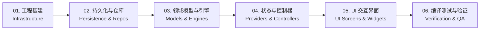

# NarrAItor 核心功能移植实施计划总览

本项目旨在将 `~/NarrAItor` 项目中的**场景对话 (Scene Dialogue)**、**资料库 (Resource Library)** 与 **设置 (Settings)** 三大核心功能模块精准移植到当前仓库 (`/home/yrz/LT`)。

为确保移植过程条理清晰、低耦合且步步可验证，整个移植工程划分为 **6 个独立阶段**，各阶段均有专属的详细设计与执行文档：

---

## 阶段规划与文档索引

| 阶段编号 | 文档链接 | 阶段名称 | 核心移植内容 | 预期交付物 | 状态 |
| :---: | :--- | :--- | :--- | :--- | :---: |
| **01** | [01_PHASE_INFRASTRUCTURE.md](./01_PHASE_INFRASTRUCTURE.md) | **工程基建与依赖初始化** | `pubspec.yaml` 裁剪、Flutter 平台与环境配置、`lib/core/` 基础主题、错误处理与公共组件 | 可正常 `flutter pub get` 的空框架，具备完整色彩/主题基础设施 | ✅ **已完成** (`859560e`) |
| **02** | [02_PHASE_PERSISTENCE_SERVICES.md](./02_PHASE_PERSISTENCE_SERVICES.md) | **数据持久化与仓库层** | SQLite 主库 `DatabaseService`（精简剥离 Naila/Creation 表）、`KeyVault`、四大 Repository 接口与实现 | 独立的 SQLite FFI 数据库，可正常持久化与查询设置、角色卡、场景状态 | ✅ **已完成** (`eee8acf`) |
| **03** | [03_PHASE_MODELS_ENGINES.md](./03_PHASE_MODELS_ENGINES.md) | **领域契约模型与业务引擎** | 场景对话双段协议契约、角色/世界观/预设模型、`ChatEngine` 状态机、`PromptBuilder`、`StreamHandler`、`LLMService` | 完整的 LLM 对话链路、上下文滑动窗口与打字机流式处理内核 | ✅ **已完成** (`abc0187`) |
| **04** | [04_PHASE_PROVIDERS_CONTROLLERS.md](./04_PHASE_PROVIDERS_CONTROLLERS.md) | **状态管理与控制器层** | 状态门面 `ChatProvider`、4 个子 Provider（Settings/Adventure/Library/Messaging）、Riverpod 容器注入装配 | 解耦后的 Riverpod 状态树，业务控制器与跨模块 Facade 门面完全可用 | ✅ **已完成** (`12c8400`) |
| **05** | [05_PHASE_UI_SCREENS.md](./05_PHASE_UI_SCREENS.md) | **UI 交互界面与页面组装** | 设置中心（`SettingsCenterScreen`）、资料库多标签编辑页（`WorldviewEditorScreen`）、对话主屏（`AdventureModeScreen`/`ChatScreen`）、全局侧边导航栏 | 完整的应用 UI 交互闭环，三大核心板块自由切换与操作 | ⚪ 未开始 |
| **06** | [06_PHASE_VERIFICATION_TESTING.md](./06_PHASE_VERIFICATION_TESTING.md) | **编译检查与端到端联调** | `flutter analyze` 静态分析清理、单元/契约测试套件、端到端真实流程联调与验收清单 | 0 报错通过静态代码分析，完整的测试用例与端到端场景验收通过 | ⚪ 未开始 |

---

## 模块解耦与保留策略

本仓库严格聚焦于**场景对话 + 资料库 + 设置**，因此对原项目进行了针对性的解耦精简：
- ❌ **移除长篇创作模式 (Creation Mode V2)**：移除章节/分卷管线、Agent 运行时机制（`CreationAgentRuntime`）、小说分配策略（`CreationProjectScalePolicy`）。
- ❌ **移除 Naila AI 助手与知识库**：移除 `naila_assistant.db`、Embedding 向量分块与后台索引 Worker。
- ✅ **保留场景对话所有玩法**：包括双段响应（正文+结构化JSON）、属性增减、金币/装备/好感度/任务系统、分支剧情与回滚重试。
- ✅ **保留资料库完整实体**：世界观预设、角色卡、NPC 档案、提示词模板、人设化身、批量导入/导出。
- ✅ **保留完整设置中心**：多模型服务商接入（DeepSeek、OpenAI、Qwen、Ollama 等）、安全密钥保管、参数微调与暗黑/明亮主题。
