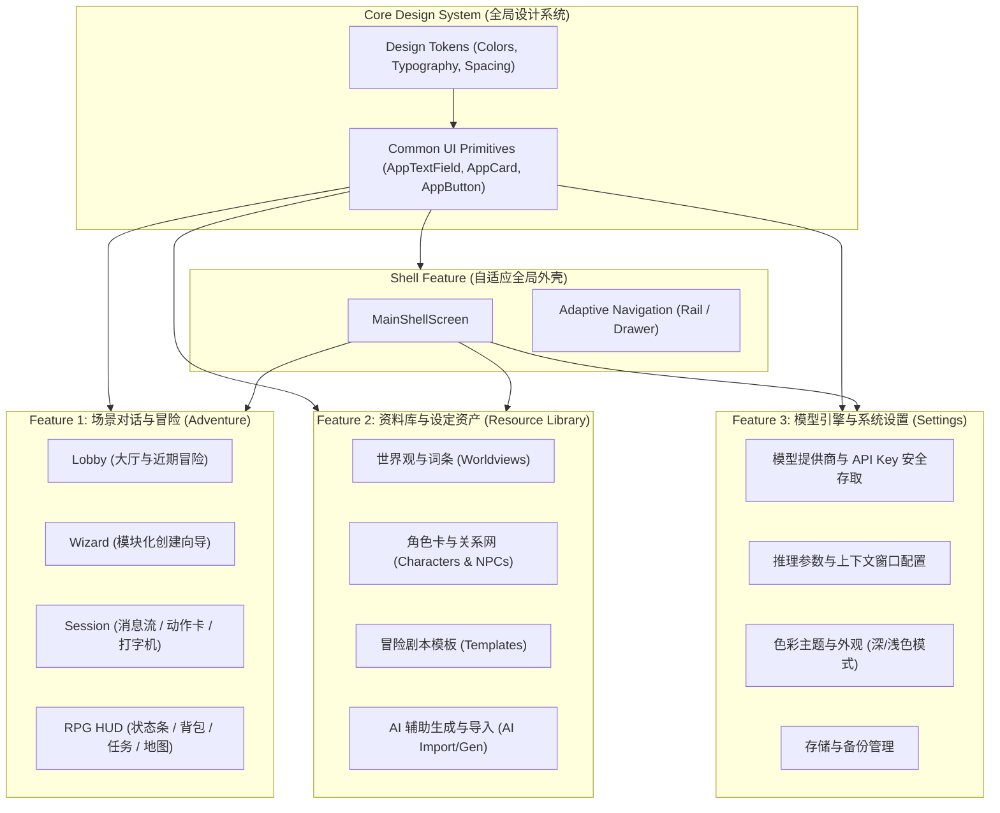

# NarrAItor 前端 UI 架构重构方案（基于功能驱动）

> **文档版本**：`1.0.0`  
> **重构基准**：功能驱动设计（Feature-First / Domain-Driven UI Architecture）  
> **核心目标**：彻底告别遗留代码中动辄上千行的“巨石组件”，以业务功能为原点，重新设计模块化、响应式、高内聚且视觉一致的现代化 Flutter 前端界面。

---

## 1. 重构背景与核心设计原则

### 1.1 现状与重构动因（Why Refactor?）
在上一阶段的移植中，前端界面基本沿袭了原项目的旧有实现，存在以下典型技术债务与体验痛点：
1. **组件严重单体化（God Widgets）**：如 `adventure_builder.dart`（3,699 行）、`settings_center_screen.dart`（1,680 行）、`chat_screen.dart`（1,050 行），单文件代码量极大，排查与维护成本极高。
2. **私有辅助方法滥用（`_buildX` 反模式）**：大量 UI 依赖父级 `BuildContext` 通过私有方法拼装，导致无法独立缓存 Element 树、无法享受 `const` 优化，且任何局部状态改变都会引起整屏无谓 Rebuild。
3. **视觉与色彩不协调（UI Consistency）**：部分界面硬编码颜色与透明度（如 API Key 输入框存在视觉突兀感、背景底色不统一），缺乏 Material 3 统一语义化设计令牌（Design Tokens）。
4. **功能混杂与逻辑泄露**：视图层直接夹杂数据库读写、文本流拼装与业务状态变更，缺乏标准的 Presentation-Domain 分离。

### 1.2 核心指导思想：**基于功能重构，而非基于当前前端**
本方案**不以修补现有旧文件为路径**，而是从**用户的核心功能场景**出发，将整个应用抽象为四大独立功能域（Feature Domains）：
- 🎮 **冒险体验域 (`adventure`)**：大厅引导、冒险创建向导、打字机对话流、RPG 状态栏（HUD）、背包/任务/属性面板、分支回滚。
- 📚 **世界观与资料库域 (`resource_library`)**：设定集与条目、角色卡/NPC 档案网、剧本模板、AI 智能生成与导入。
- ⚙️ **模型与系统设置域 (`settings`)**：多厂商 API 服务管理、密钥安全存取、生成超参调优、提示词系统、主题外观与数据备份。
- 🧭 **全局外壳与设计系统域 (`shell` & `design_system`)**：自适应侧边导航轨/抽屉、语义化统一色彩、全局状态反馈（Toast/Dialog/Overlay）。

---

## 2. 方案需要调用的技能库（Skill Mapping）

在实施各阶段任务时，必须严格调用并遵循以下已安装的专业 Skill：

| 阶段/任务领域 | 调用的专业 Skill | 在本方案中的具体指导职责 |
| :--- | :--- | :--- |
| **整体架构规划** | [**`flutter-best-practices`**](../.agents/skills/flutter-best-practices/SKILL.md) | 指导 Feature-First 目录规范、Presentation/Domain/Data 严格分层、MVVM 模式与各层依赖单向性。 |
| **组件拆解与优化** | [**`flutter-ui-refactoring`**](../.agents/skills/flutter-ui-refactoring/SKILL.md) | 彻底消除 `_buildX` 私有方法；提取独立 `StatelessWidget`/`StatefulWidget`；将 Rebuild 作用域下沉到叶子节点；全局强化 `const` 构造函数优化。 |
| **响应式布局** | [**`flutter-use-column-row-first`**](../.agents/skills/flutter-use-column-row-first/SKILL.md) | 指导自顶向下的 Flex（Column/Row/Expanded/Flexible/Spacer）布局流，杜绝绝对像素写死，保障多端（桌面/平板/移动端）自适应。 |
| **排障与防溢出** | [**`flutter-errors`**](../.agents/skills/flutter-errors/SKILL.md) | 预防和治理 `RenderFlex overflow`（黄黑斑马线）、`Vertical viewport given unbounded height`、`setState() called during build` 等常见框架异常。 |
| **状态解耦与语言规范** | [**`dart-refactoring`**](../.agents/skills/dart-refactoring/SKILL.md) & [**`effective-dart`**](../.agents/skills/effective-dart/SKILL.md) | 指导将嵌入界面的复杂业务状态提升解耦至 Riverpod Notifier；升级 Dart 3 现代语法（Pattern Matching、Sealed Classes、Records）；统一代码风格与命名。 |
| **状态精细化订阅** | [**`riverpod`**](../.agents/skills/riverpod/SKILL.md) | 指导 Provider 细粒度划分，使用 `ref.watch(provider.select(...))` 限制重建颗粒度，实现高性能局部更新。 |
| **质量验证闭环** | [**`testing`**](../.agents/skills/testing/SKILL.md) & [**`mocktail`**](../.agents/skills/mocktail/SKILL.md) | 为每个解耦后的小型组件与页面编写 Widget 测试、交互驱动测试，建立防劣化基准线。 |

---

## 3. 功能架构与目标目录结构设计

采用标准的 **Feature-First + Clean Architecture (Presentation Layer)** 目录骨架：

```text
lib/
├── core/
│   ├── theme/                       # 统一设计系统（Design System）
│   │   ├── app_colors.dart          # M3 语义化色彩令牌与预设色板
│   │   ├── app_theme.dart           # ThemeData 统一配置（输入框、卡片、按钮）
│   │   ├── app_typography.dart     # 层次分明的字体排版规范
│   │   ├── app_spacing.dart        # 8dp 栅格间距体系
│   │   └── app_radius.dart         # 统一圆角规格
│   ├── widgets/                     # 跨业务纯通用 UI 原语
│   │   ├── app_button.dart         # 标准主/次按钮
│   │   ├── app_card.dart           # 标准容器卡片
│   │   ├── app_text_field.dart     # 统一样式输入框（彻底解决色调不一致痛点）
│   │   └── app_modal.dart          # 响应式弹窗与底部抽屉
├── features/                        # 按业务功能垂直切分
│   ├── shell/                       # 全局外壳与导航
│   │   └── presentation/
│   │       ├── screens/main_shell_screen.dart
│   │       ├── widgets/adaptive_nav_rail.dart
│   │       └── controllers/navigation_controller.dart
│   ├── adventure/                   # 功能1：AI 场景对话与跑团冒险
│   │   └── presentation/
│   │       ├── lobby/               # 场景大厅与冒险列表
│   │       │   ├── screens/adventure_lobby_screen.dart
│   │       │   └── widgets/recent_adventure_card.dart
│   │       ├── wizard/              # 冒险向导（拆解原 3700 行 builder）
│   │       │   ├── screens/adventure_wizard_screen.dart
│   │       │   └── widgets/{step_worldview, step_character, step_opening}.dart
│   │       ├── session/             # 对话进行主屏幕
│   │       │   ├── screens/adventure_session_screen.dart
│   │       │   └── widgets/
│   │       │       ├── dialogue_stream_view.dart     # 滚动消息流
│   │       │       ├── typewriter_bubble.dart        # Markdown/打字机消息
│   │       │       ├── action_options_panel.dart     # 剧情选项按键组
│   │       │       └── dialogue_input_bar.dart       # 底部交互栏
│   │       ├── hud/                 # 角色状态与 RPG 面板
│   │       │   └── widgets/{status_bar, inventory_sheet, quest_sheet, map_sheet}.dart
│   │       └── controllers/         # UI 专用细粒度控制器
│   ├── resource_library/            # 功能2：世界观与设定资料库
│   │   └── presentation/
│   │       ├── screens/resource_library_screen.dart
│   │       ├── worldview/widgets/{worldview_grid, worldview_detail_dialog}.dart
│   │       ├── character/widgets/{character_card_grid, character_editor_modal}.dart
│   │       ├── npc/widgets/{npc_list_tile, npc_relations_view}.dart
│   │       ├── template/widgets/adventure_template_card.dart
│   │       └── ai_tools/widgets/{ai_generate_sheet, ai_import_dialog}.dart
│   └── settings/                    # 功能3：模型引擎与系统配置
│       └── presentation/
│           ├── screens/settings_screen.dart
│           └── widgets/
│               ├── provider_config_section.dart  # 模型厂商与 Key 安全配置
│               ├── model_params_section.dart     # 温度、Top-P、滑动窗口滑块
│               ├── prompt_preset_section.dart    # 系统预设提示词
│               ├── appearance_section.dart       # 主题色盘与深浅色模式切换
│               └── data_management_section.dart  # 数据库备份与缓存清理
```

---

## 4. 四大功能域重构详细方案



---

### 4.1 功能域一：模型引擎与系统设置 (`settings`)
#### 🎯 针对痛点解决：彻底解决 API Key 输入框颜色突兀、背景不一致问题
- **重构原则**：
  - 调用 **`flutter-ui-refactoring`** 与 **`flutter-best-practices`**。
  - 将原 1,680 行的 `settings_center_screen.dart` 拆解为 5 个功能垂直的独立 Section 组件。
  - **统一背景与表面颜色层级**：
    - `Scaffold.backgroundColor`: 统一采用 `colorScheme.surface`。
    - 卡片与输入框底色：统一采用 `colorScheme.surfaceContainer` 或 `surfaceContainerLow`，杜绝随意定义 `alpha: 0.1` 导致的脏色。
    - API Key 与所有表单控件：统一采用标准化 `AppTextField`，状态边框采用 `colorScheme.outlineVariant`，聚焦高亮采用 `colorScheme.primary`，文字与占位符遵从 WCAG AA 7:1 对比度标准。
- **拆分交付物**：
  - `ProviderConfigSection`：厂商下拉、Base URL、API Key（脱敏与显隐切换）、一键“测试连接”状态指示灯。
  - `ModelParamsSection`：温度（Temperature）、Top-P、最大上下文长度滑块。
  - `AppearanceSection`：12 种主题预设色板选择器、明亮/暗黑/跟随系统切换开关。
  - `DataManagementSection`：SQLite 存储空间占用、缓存清空与全库导出。

---

### 4.2 功能域二：AI 场景对话与跑团冒险 (`adventure`)
#### 🎯 针对痛点解决：拆解 3,700 行向导巨石与 1,050 行聊天巨石，重构极简交互
- **重构原则**：
  - 调用 **`flutter-ui-refactoring`**、**`flutter-use-column-row-first`** 与 **`flutter-errors`**。
  - **创建向导（Wizard）分步化**：
    - 将 3,700 行的 `adventure_builder.dart` 彻底废弃，重构为轻量的向导流程控制器与 4 个自包含步骤视图（`StepWorldviewSelect` ➔ `StepProtagonistSelect` ➔ `StepRulePresets` ➔ `StepOpeningPreview`）。
  - **消息流高效局部渲染（Session）**：
    - 消除 `chat_screen.dart` 中的冗长私有渲染函数。
    - 打字机逐字输出（Streaming Typewriter）限制在专属的 `TypewriterBubble` 内部刷新，避免整个列表重绘引起卡顿。
    - 选项交互面板（`ActionOptionsPanel`）：响应式弹性流排布（Wrap/Row），点击触发时派发独立事件。
  - **RPG 状态 HUD 悬浮化与抽屉化**：
    - 顶部/侧边常驻状态条（生命值、金币、MP、当前地点）。
    - 底部或侧边弹出专属 Sheet：`InventorySheet`（背包物品）、`QuestSheet`（任务目标）、`WorldMapSheet`（节点地图）。

---

### 4.3 功能域三：世界观与设定资料库 (`resource_library`)
#### 🎯 针对痛点解决：资产多标签管理扁平化与可视化编辑
- **重构原则**：
  - 调用 **`flutter-best-practices`** 与 **`dart-refactoring`**。
  - 将世界观、角色卡、NPC、预设模板由平铺杂乱列表升级为**卡片网格与抽屉详情**结合的现代化 Codex 资料库。
  - 角色卡编辑采用标准 Modal / Dialog 模式，表单与数据校验统一，支持头像色彩徽章。
  - AI 导入功能（`AiImportDialog`）独立封装，具备生成进度条与结构化 JSON 预览确认能力。

---

### 4.4 功能域四：统一设计系统与全局外壳 (`core/theme` & `shell`)
#### 🎯 针对痛点解决：视觉语言统一、自适应多端
- **设计系统（Design System）规范**：
  - 基于 Material 3 标准，确立 3 级色彩层次：
    - **Base Layer (背景层)**：`theme.colorScheme.surface`
    - **Container Layer (卡片容器层)**：`theme.colorScheme.surfaceContainer`
    - **Elevated/Input Layer (表单输入层)**：`theme.colorScheme.surfaceContainerHigh`
  - 彻底清理遗留代码中杂乱的 `AppColors.bubbleUser`、`AppColors.surfaceElevated` 等硬编码静态常量，全面转为动态 `Theme.of(context).colorScheme`。
- **全局外壳（MainShell）**：
  - 桌面端（宽屏 > 800dp）：采用左侧悬浮 Navigation Rail，右侧内容区自适应流式排布。
  - 移动端/窄屏：采用标准底部 Navigation Bar 或侧边抽屉，保证单手操作舒适度。

---

## 5. 分阶段实施路线图（Phased Roadmap）

| 阶段 | 实施内容 | 产出物 | 核心调用的 Skill |
| :---: | :--- | :--- | :--- |
| **Phase 1** | **设计系统基石与通用原语** | 统一 `AppTheme`，实现 `AppTextField`、`AppCard`、`AppButton`，彻底根治 API Key 输入框等底色突兀问题。 | `flutter-ui-refactoring`、`effective-dart` |
| **Phase 2** | **设置中心功能模块重构** | 拆解 1,680 行代码，重塑 `ProviderConfigSection`、`ModelParamsSection`、`AppearanceSection`。 | `flutter-best-practices`、`flutter-use-column-row-first` |
| **Phase 3** | **资料库与世界观资产重构** | 重构卡片网格列表、角色编辑弹窗与 AI 导入对话框。 | `flutter-ui-refactoring`、`dart-refactoring` |
| **Phase 4** | **冒险向导与场景大厅重构** | 废弃 3,700 行遗留向导，构建极简 4 步创建向导与大厅列表。 | `flutter-best-practices`、`flutter-use-column-row-first` |
| **Phase 5** | **对话主屏与 RPG HUD 重构** | 拆解 1,050 行聊天屏，重构独立打字机气泡、选项面板与背包/任务抽屉。 | `flutter-ui-refactoring`、`riverpod`、`flutter-errors` |
| **Phase 6** | **全端适配与质量验证闭环** | 全局自适应外壳（Navigation Rail）、全套 Widget 测试与性能帧率检查。 | `testing`、`mocktail` |

---

## 6. 验证与验收标准（Verification Plan）

1. **静态检查**：`flutter analyze` 保持 0 错误、0 警告。
2. **视觉与主题一致性验收**：
   - 切换 12 套主题色板及深/浅色模式时，所有页面（特别是设置中心、API Key 输入框、聊天气泡）背景与输入框底色浑然一体，无任何视觉突兀或文字对比度不足。
3. **性能与重建测试**：
   - 在对话流进行打字机流式输出时，使用 Flutter DevTools 监测，界面帧率稳定在 60fps，除当前消息气泡外，父级容器与外部组件 Rebuild 次数为 0。
4. **自动化测试套件**：
   - 编写并运行每个独立新组件的 Widget 测试，覆盖率达标，且全套回归测试 `flutter test` 全部一次性通过。
