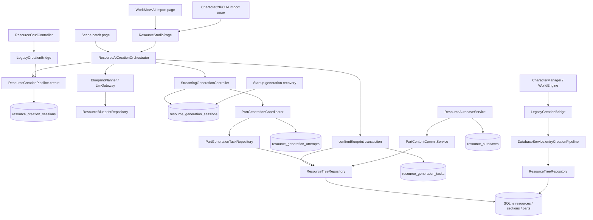

# Import Authority Full Chain Audit

- 审计状态：**FAILED（存在需要在收敛重构中处理的 MAJOR 风险）**
- 审计日期：2026-09-24
- 审计基线：main@dfd41da
- 工作区：审计开始时 git status --short 为空；本阶段只新增本报告。
- 审计方式：只读搜索、调用链跟踪、状态机/DDL/Provider/测试结构核对；未修改 Dart、测试或 schema，未提交 Git。

## 1. Executive Summary

当前 LT 的资源树持久化 Authority 已基本统一：生产 Riverpod 图把 Resource CRUD、旧兼容入口和 Resource Studio 接到 ResourceCreationPipeline，最终由 ResourceTreeRepositoryImpl 在 SQLite 事务中写入 resources → resource_sections → resource_parts。AI 创建的生产主路径是：

ResourceAiCreationOrchestrator → ResourceCreationPipeline → BlueprintPlanner → ResourceBlueprintRepository.confirmBlueprint → StreamingResourceGenerationController/Service → PartGenerationCoordinator → PartGenerationTaskRepository → ResourceTreeRepository。

但“单一 Authority”目前只在逻辑类/协议层成立，尚未在所有组合根做到单一实例：

1. Riverpod 图创建带完整 streaming infrastructure 的 Pipeline（lib/providers/riverpod_providers.dart:203-205,480-521）。
2. DatabaseService.entryCreationPipeline 又懒创建另一 Pipeline（lib/services/database_service.dart:94-118），并被 ChatProvider.withRepos 未注入的 CharacterManager 与 WorldEngine 使用（lib/providers/chat_provider.dart:213-224、lib/managers/character_manager.dart:26-35、lib/engines/world_engine.dart:38-49）。

两者共用数据库和写入语义，但依赖集合不同：Riverpod 实例注入 Blueprint/Generation 依赖；entry 实例只注入 revision capture，并把 AI capability 固定为 true。这使未来从旧组合根发起 AI 或扩展 Pipeline 行为时存在分叉风险。

旧 Import 层已经从当前页面生产路径移除：Worldview/Character 页面导航到 Resource Studio，Scene Batch 通过 createAndPlan → candidate select → confirmAndStart 进入 Runtime。可是 Import*UseCase.generate/save/importSelected 和三个 Import Controller 的旧状态/生成 API 仍在生产编译图中注册，且测试直接调用它们；它们构成可重新接线的第二套生成语义，当前应视为兼容遗留面，而不是新的生产 Authority。

## 2. Architecture Diagram



## 3. Authority Analysis

### 3.1 Entry inventory

| 入口 | 当前生产动作 | 分类 | 最终写入 |
| --- | --- | --- | --- |
| Worldview AI import | 构造 ResourceStudioCreationDraft 并导航到 Studio（worldview_ai_import_page.dart:183-209） | 当前生产入口 | Orchestrator/Runtime |
| Character/NPC AI import | 构造 ResourceStudioCreationDraft 并导航到 Studio（resource_card_ai_import_page.dart:250-300） | 当前生产入口 | Orchestrator/Runtime |
| Scene Batch | createAndPlan，用户筛选 Blueprint Parts，再 confirmAndStart（scene_batch_import_page.dart:161-243） | 当前生产入口 | Orchestrator/Runtime |
| Resource Studio | createAndStart 或 createAndPlan/confirmAndStart（resource_studio_runtime.dart:209-267） | 当前生产入口 | Orchestrator/Runtime |
| Library CRUD | ResourceCrudController → LegacyCreationBridge.save* | 当前生产入口 | Pipeline/tree repository |
| CharacterManager / WorldEngine | 默认使用 DatabaseService.entryCreationPipeline | 当前生产入口（旧组合根） | 第二个 Pipeline/tree repository |
| Import*UseCase.generate/save | 仍存在，当前页面不调用 | 历史/兼容入口；测试可达 | 旧 Draft → Bridge/Pipeline |
| SceneBatchImportUseCase.importSelected/identify | 当前 Scene Batch 页面不调用 | 历史/测试入口 | 旧 LLM/Bridge |
| ResourceLibraryImportController 等 | 页面仍注册并读取用于旧 UI 状态，当前 AI 操作不调用其旧生成 API | 遗留 ViewState/兼容层 | 不应拥有业务终态 |
| ResourceMigrationService | 迁移旧表到 ResourceTree | 一次性迁移入口 | Pipeline/tree repository |

### 3.2 Current creation Authority

- 逻辑 Authority：ResourceCreationPipeline 的 create/createBatch，其事务内调用 ResourceTreeRepositoryImpl.create/updateResourceTreeInTransaction（resource_creation_pipeline.dart:173-492）。
- AI planning/confirmation Authority：ResourceAiCreationOrchestrator，通过 Pipeline、BlueprintRepository 和 Generation Controller 建立持久化身份（resource_ai_creation_orchestrator.dart:44-275）。
- 正文 generation/commit Authority：StreamingResourceGenerationService + PartGenerationCoordinator + PartGenerationTaskRepository；Part commit 使用 attempt/source-token CAS（part_generation_coordinator.dart:843-1006,1343-1378；resource_generation_task_repository.dart:430-520）。
- 实际 Resource 创建结果位置：Blueprint confirmation 或手工 Pipeline transaction 创建/替换树；AI 正文最终由任务提交链写入 Part。

结论：最终树写入没有发现绕过 Repository 的生产 SQL 写入口；但 Pipeline 实例组合根不唯一，生成语义仍有遗留 API 双表面。

### 3.3 ImportController audit

当前 Controller 字段主要是 phase/draft/error/progress/_generation/_disposed（resource_library_import_controller.dart:18-33）。_generation 只做回调 fence，不能取消 HTTP/SSE、不能创建 Attempt、不能阻止已进入持久化边界的旧请求。

当前页面的 AI 按钮不再调用 Controller 的 generate/save；页面仍 watch/read Controller 并读取 phase（worldview_ai_import_page.dart:35-57、resource_card_ai_import_page.dart:55-92），因此 Controller 仍是过时的 UI 状态来源，容易与 Studio Runtime 状态并存。

- 当前职责：兼容旧 Import 草稿/状态 API，向旧 UseCase 转发。
- 目标职责：仅保留输入/ViewState 与回调 fence；Runtime/CreationSession/GenerationSession 才拥有业务生命周期。
- 需要删除或隔离：generate*、save*、本地 terminal/background 语义及不再使用的 provider wiring；至少先标记 deprecated 并阻止新生产入口依赖。

### 3.4 ImportUseCase audit

import_use_cases.dart 同时公开两套面：

- 旧面：generate → Draft → save（如行 47-80、154-323、394-496、568-679）。
- 新面：plan → planBlueprint → confirmBlueprint（行 97-152、343-387、511-557）。

旧面会直接调用 LlmGateway.generate*，但当前页面生产路径已改为 Runtime；测试仍直接覆盖旧 save/plan API。危险点是旧面仍可由任何生产代码调用，重新接线后会绕过 persisted GenerationSession/Task/Attempt、Runtime cancel/recovery 和 patch validator。

- 当前定位：兼容 Adapter/测试 seam。
- 迁移：保留手工保存的 save* 直到调用方迁移完成；删除或隔离 AI generate/importSelected/identify，让所有 AI 生成只经 Orchestrator。

### 3.5 LegacyCreationBridge audit

LegacyCreationBridge 本身主要是参数映射与提交 Adapter（legacy_creation_bridge.dart:48-286），不直接生成正文、不维护后台任务、不拥有独立状态机；saveWorldview/saveCard/saveCards 最终调用 Pipeline。

- 当前定位：参数转换 + 兼容保存 Adapter。
- 是否需要瘦身：是，移除 AI planning/compatibility methods 后只保留手工/导入 payload mapping。
- 是否可以删除：不能立即删除；CharacterManager、WorldEngine、ResourceCrudController 与旧测试仍依赖它。应在所有调用方改为明确的 Pipeline port 后再删除。

## 4. State, Persistence and Consistency

| 状态 | 当前来源 | 是否持久化 | 一致性结论 |
| --- | --- | --- | --- |
| Resource node status | resources.status、sections/parts.status | 是 | NodeStateMachine 约束合法边 |
| Creation phase | resource_creation_sessions.status | 是 | Pipeline/BlueprintRepository 更新 |
| Blueprint status | resource_blueprints.status | 是 | confirm 事务更新 |
| Generation lifecycle | resource_generation_sessions.status | 是 | StreamingLifecycleStateMachine |
| Part task/attempt | resource_generation_tasks、resource_generation_attempts | 是 | Runtime commit owner |
| Section validation | resource_sections.validation_state/message/validated_at | 是 | Section control service |
| Import phase/draft | Controller 内存 | 否 | ViewState，不能作为业务 Authority |
| Autosave status | resource_autosaves | 是 | Autosave/commit service |

CreationSession 在 Blueprint confirm 事务中被写为 completed（resource_blueprint_repository.dart:471-480），而 GenerationSession 随后才创建/启动（resource_ai_creation_orchestrator.dart:218-275）。这代表“创建请求已确认”与“资源正文已可消费”是两个事实；任何以 CreationSession.completed 直接展示资源完成的调用方都会产生 UI 完成、正文仍未完成的状态漂移。Adventure 侧目前用 assembly readiness gate 拦截未 ready 资源，但该约束没有被 CreationSession 类型本身表达。

数据库 DDL 固定为三层树：resources、resource_sections、resource_parts；Section 外键 resource_id，Part 外键 section_id，均 ON DELETE CASCADE；长正文只存 resource_parts.content；Section 校验状态在 v38 增加，generation_state 由任务/正文推导而不重复落库。

Blueprint confirm 在一个事务内写 placeholder tree、generation tasks、Blueprint confirmed 和 CreationSession completed（resource_blueprint_repository.dart:221-480）；Part commit 另在事务内做 source-token/attempt CAS。未发现明确的孤儿 Section/Part 生产写路径。

### Autosave / Recovery

- ResourceAutosaveService 与 PartContentCommitService 以 checkpoint/hash/token 处理草稿、冲突、应用和丢弃，正常流式生成不写 autosave 表。
- StreamingResourceGenerationService.recoverInterruptedGeneration 先恢复任务，再标记会话 recovering；启动 Provider 在 main.dart:222-229 触发，autoResume:false，避免重放计费请求。
- Runtime 具备 pause/resume/cancel/retry、attempt identity、late-result CAS 和最终清理 active handles；旧 Import direct LLM 路径不具备同等恢复能力。

## 5. Risk Assessment

### BLOCKER

当前没有证据表明生产树写入绕过事务 Repository，或存在必然数据破坏，因此本轮未定级 BLOCKER。

### MAJOR

#### M1 — 两个生产组合根构造不同的 ResourceCreationPipeline

- 位置/路径：riverpod_providers.dart:203-205,480-521；database_service.dart:94-118；chat_provider.dart:213-224；character_manager.dart:26-35；world_engine.dart:38-49。
- 触发条件：通过 Riverpod Resource CRUD/Studio 与通过 ChatProvider 默认 CharacterManager/WorldEngine 保存同一资源。
- 影响：两个 Pipeline 共享 SQLite 但不共享 planner/coordinator/repository 对象和 capability 配置；entry Pipeline 将 hasAiCredentials 固定为 true，未来若旧组合根调用 AI request，会绕过真实凭证门禁。新增 Pipeline 行为/依赖时只更新一处会产生分叉。
- 根因：单一 Pipeline 只在类契约与注释中定义，composition root 没有强制所有 Provider 注入同一实例。
- 修复与验证：从 app composition root 创建唯一 Pipeline 并注入 ChatProvider/AdventureProvider/LibraryProvider；删除 entryCreationPipeline 或令其仅作为显式测试适配器。增加 real SQLite wiring test，断言所有默认构造路径与 resourceCreationPipelineProvider identity 相同，并覆盖 AI capability。
- 等级依据：当前手工写入通常仍正确，因此不是已发生的数据损坏；但它违反唯一 Authority 不变量，且未来扩展会产生可复现的行为分叉。

#### M2 — CreationSession.completed 与 Resource 消费完成不是同一事实

- 位置/路径：resource_blueprint_repository.dart:471-480 → resource_ai_creation_orchestrator.dart:218-275 → resource_generation_sessions；ResourceAssemblyReadinessCoordinator/Gate。
- 触发条件：Blueprint 确认成功后，正文 Runtime 尚未完成或随后失败；调用方读取 CreationSession.status 作为资源完成标志。
- 影响：UI/统计/恢复代码可能显示“创建完成”，而 Part 仍为空、GenerationSession failed/paused；若绕过 assembly readiness gate 读取，会消费未完成资源。
- 根因：CreationSession、GenerationSession、ReadinessState 三个持久化状态没有统一的“可消费完成”投影；状态机允许各自终态。
- 修复与验证：明确 CreationSession.completed 语义为 Blueprint confirmed；新增只读 readiness projection/查询，所有完成提示和资源入口使用 GenerationSession + assembly readiness；测试 plan/confirm 成功后 generation fail 的状态组合。
- 等级依据：当前 Adventure gate 已 fail-closed，风险集中在其他调用方和未来误用，但不应继续把 completed 当作资源完成。

### MINOR

#### m1 — 遗留 Import Controller/UseCase 仍保留第二套 AI 生成语义

- 位置/路径：import_use_cases.dart:47-80,154-323,394-496,568-679；controllers/resource_*_import_controller.dart；Provider 注册于 riverpod_providers.dart:271-325。
- 触发条件：新代码调用旧 generate/save/importSelected/identify，或页面重新接回 controller action。
- 影响：直接 structured LLM → Draft 路径没有 GenerationSession/Attempt/Patch protocol/Runtime recovery；Controller _generation 只 fence UI callback，不能取消底层请求。
- 根因：导航迁移后只移除了当前页面调用，未清理兼容 API 与 provider。
- 修复与验证：将旧 AI 方法标记 deprecated；迁移测试到 Orchestrator；删除未使用的 Controller generation state；架构 guard 改为调用图/编译层约束，而非只做字符串扫描。

#### m2 — 生产 wiring 测试未覆盖第二组合根和真实页面闭环

- 证据：test/application/runtime/r05_production_wiring_test.dart 只断言 Riverpod CRUD 与其 Pipeline identity；test/architecture/generation_authority_guard_test.dart 主要是源文件字符串禁用检查；creation_entry_points_test.dart 直接调用 UseCase/Controller。
- 影响：测试可证明新 Runtime 组件存在，却不能证明 ChatProvider 默认构造、WorldEngine/CharacterManager 与 UI 页面均使用同一实例或完成相同生命周期。
- 修复与验证：增加真实 Provider/ChatProvider composition test；增加页面级 plan→confirm→generation-session test；验证失败、取消、恢复和 readiness gate 的组合状态。

### INFO

- 当前 schema 已是 v44，不是任务文字中的 v42：v42 增加 assembly readiness，v43 清理旧 Quest/Map，v44 增加 target_characters（database_service.dart:38-47,560-583）。Import Authority 收敛本身不要求新增 migration；若改动状态投影或统一实例接线，优先兼容现有 v44 表。
- DDL 的外键、CAS 和事务边界目前足以阻止大多数孤儿树/迟到 Part 覆盖；这些是已确认的保护，不应在后续重构中移除。
- LegacyCreationBridge 是参数 Adapter，不是独立保存 Authority；删除它前需完成调用方迁移。

## 6. Migration Plan

### Phase 1

1. 在唯一 app composition root 构造 Pipeline、Bridge、BlueprintRepository、GenerationTaskRepository、Generation Runtime。
2. 将该 Pipeline 显式注入 ChatProvider.withRepos → AdventureProvider/LibraryProvider → WorldEngine/CharacterManager。
3. 把 DatabaseService.entryCreationPipeline 改为测试/迁移专用或删除。
4. 增加 identity/capability/wiring tests，覆盖手工 CRUD、AI planning、Scene Batch plan/confirm、Runtime start。

### Phase 2

1. 保留 LegacyCreationBridge.save* 作为手工 payload Adapter。
2. 把 Import*UseCase.generate/save 的 AI 生成部分迁移到 Orchestrator；旧方法标记 deprecated 后删除。
3. 删除 Import Controller 的业务 phase/background 字段，只保留输入、错误呈现和 callback fence。
4. 删除旧 identify/importSelected 生产编译面，或改成 Runtime Blueprint planning 的薄 UI Adapter。
5. 把测试从旧 Draft 路径迁移到真实生产路径。

### Phase 3

1. 规定 CreationSession 只表示请求/Blueprint 阶段；GenerationSession + AssemblyReadiness 才表示可消费资源。
2. 提供单一 ResourceCreationStatus 查询/投影，禁止 UI 自行拼接多个状态。
3. 所有保存调用方改用明确的 Creation/Tree port 后删除 LegacyCreationBridge。
4. 仅在投影确需持久化时增加 schema migration；否则 v44 保持兼容。
5. 验收 late result、cancel、retry、restart recovery、autosave conflict、section validation and readiness combinations。

## 7. Recommended Target Architecture

```text
UI/ViewState
  → ResourceAiCreationOrchestrator (AI create/plan/confirm authority)
  → ResourceCreationPipeline (session/idempotency/manual tree boundary)
  → BlueprintRepository (validated placeholder/task transaction)
  → StreamingGenerationService (session lifecycle/recovery)
  → PartGenerationCoordinator (attempt/retry/patch validation)
  → PartGenerationTaskRepository (CAS atomic Part commit)
  → ResourceTreeRepository (single SQLite tree writer)
  → AssemblyReadinessCoordinator (only publishable revision)
```

- 每个进程只有一个 composition-root Pipeline 实例。
- Controller 不生成、不保存、不推进持久化状态。
- CreationSession、Blueprint、GenerationSession、Readiness 通过明确投影关联，而不是互相冒充终态。
- 旧页面只负责输入、候选选择、导航和 Runtime 事件展示。
- 所有 AI LLM 调用都必须由 Blueprint/Generation Runtime 持有 cancellation、retry、attempt、late-result isolation 和 recovery。

## 8. Implementation Checklist

- [ ] 让 ChatProvider/AdventureProvider/LibraryProvider 显式接收并转发唯一 Pipeline。
- [ ] 删除或隔离 DatabaseService.entryCreationPipeline。
- [ ] 增加跨组合根 Pipeline identity 与 capability 测试。
- [ ] 固定 CreationSession.completed 的语义并统一可消费完成投影。
- [ ] 为 plan/confirm/generation fail、cancel、resume、restart recovery 增加组合测试。
- [ ] 标记并迁移 Import*UseCase.generate/save/importSelected/identify。
- [ ] 移除 Import Controller 的业务状态和旧生成 API。
- [ ] 将 architecture guard 从字符串扫描升级为真实 wiring/调用测试。
- [ ] 保留并回归 SQLite 事务、外键、attempt/source-token CAS、autosave conflict、section validation。
- [ ] 仅在投影确需持久化时增加 schema migration；基线当前为 v44。
- [ ] 完成后运行定向资源测试、migration 测试、generation recovery 测试，再决定是否全量 Flutter test。

## 9. Audit Evidence and Scope

已核对的主要证据：

- application/resources/resource_creation_pipeline.dart
- application/resources/legacy_creation_bridge.dart
- application/resource_library/import_use_cases.dart
- controllers/resource_*_import_controller.dart
- features/resource_studio/application/use_cases/resource_ai_creation_orchestrator.dart
- application/resources/streaming_resource_generation_service.dart
- application/resources/part_generation_coordinator.dart
- application/resources/resource_generation_task_repository.dart
- application/resources/resource_autosave_service.dart
- application/resources/resource_blueprint_repository.dart
- services/repositories/resource_tree_repository_impl.dart
- services/database_service.dart
- providers/riverpod_providers.dart、providers/chat_provider.dart
- Import/creation/generation/recovery/migration tests under test/application/resources, test/application/runtime, test/architecture.

未执行全量运行时测试或模拟器验证；本任务是静态只读审计，代码与测试均未改动。
