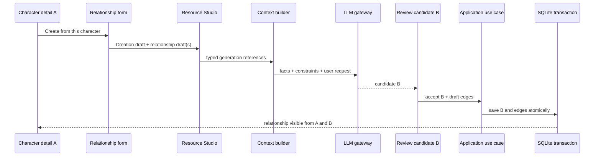

# Related Character Generation Design

## 1. Executive Summary

LT currently supports passing selected character facts into AI character generation, but it does not provide a durable, user-authoritative resource relationship. This design adds a `Character → Related Character Generation Pipeline`: a character detail action creates a relationship draft, the draft and bounded source facts flow through the existing Resource Studio pipeline, the user reviews the candidate, and one application-level save transaction persists the new character and the relationship. The relationship is later visible from either character and can be projected into an Adventure snapshot.

This document is a design only. No production code, schema, migration, UI, test, or implementation has been changed for this task.

## 2. Current Repository Baseline

- Baseline: branch `main`; `HEAD` and `origin/main` are `6c86f700d8b81d31d4043fbed5279a12e2c55f0d` (`fix(adventure): link character presence to scene state and converge quick menu`).
- The worktree already contains unrelated, uncommitted UI, localization, generated localization, platform registration, dependency, and widget-test changes. They are outside this design and must remain untouched.
- Character assets are still exposed through legacy-shaped `character_cards`/`npc_cards` rows and `LibraryRepository`; the adaptive resource system is the newer creation and lifecycle authority, with `ResourceStudioCreationDraft`, creation sessions, blueprints, streaming generation, revisions, and `resource_trash`.
- `ResourceStudioCreationDraft` already carries type, name, reference source, target length, origin, library mode, idempotency key, target resource ID, and origin worldview. This is the correct integration seam; a second character generator is prohibited.
- `CharacterReferenceContextMapper` currently maps selected stored rows to `List<Map<String,String>>` containing `name`, `gender`, `profession`, `personality`, `background`, and `appearance`. It does not emit relation data or IDs.
- `AiGeneratorService.textToCharacterCard` and detailed generation accept `associatedCharacters` maps. Existing prompts use selected names and some facts, accept `relation` or `relationship` aliases, and add a duplicate-name guard. This is an adapter capability, not a durable domain model.
- Resource Studio is the actual generation/review surface. The old import controllers, `LegacyCreationBridge`, `DatabaseService.entryCreation*`, and related legacy authority were removed or bypassed by the resource architecture commits; they must not be revived.
- `AdventureCharacterRelationship` in `lib/models/adventure_config.dart` currently has source/target IDs, one relation type, custom name, description, and an unordered `stableId` that sorts IDs. It belongs to `AdventureConfig.characterRelationships` and is a snapshot/config concept.
- `ContextOrchestrator`, `NarrativeContext`, `WeightedContextPlanner`, and `PromptCompiler` are the runtime context authority. Resource generation has a separate reference/prompt path and must converge through a typed generation contract rather than appending strings in a screen.
- Character deletion is mediated by `LibraryRepository` and the resource trash bridge. The adaptive lifecycle records revisions and `resource_trash`; unresolved references must never render as an unknown ID.

## 3. Git Archaeology

The historical search covered the requested paths and string terms (`associatedCharacters`, `relateCharacters`, `characterRelationships`, `AdventureCharacterRelationship`, 关联角色, 关系).

- `be86b1e`/early UI history introduced the original character/adventure generation concepts and map-shaped associated-character prompt inputs.
- `d66c725` hardened detailed character generation; its staged flow propagated associated-character maps through identity, appearance/background, and relationship notes, and guarded duplicate names.
- `57b2fd9` and `fd6673d` completed the adaptive Resource Studio authority and removed legacy import generation authority. `fd6673d` specifically deleted legacy bridges/controllers/use cases and retained a typed `CharacterReferenceContextMapper` at the presentation/application boundary.
- `7c52c02` separated asset relation suggestions while deleting the old `AdventureDraftController`; this is evidence that old wizard relation editing was an Adventure concern, not a durable resource relationship authority.
- `b755436`, `6a129df`, and `c6c367a` hardened Adventure relationship/status identity and unset semantics. The sorted Adventure stable ID is intentionally unsuitable as a general directional resource relationship identity.

What existed historically: selected related-character facts, relation text in prompts, Adventure relationship editing/suggestions, and detailed-generation relationship notes. What was not retained as a current closed loop: a character-detail entry point, a typed relationship specification, post-review relationship persistence, resource relationship browsing/editing, and atomic character-plus-edge saving. The useful semantic intent is “source facts plus explicit bond improve generation”; the obsolete architecture must not be restored.

## 4. Existing Capabilities and Missing Closed Loop

| Capability | Current state | Design gap |
|---|---|---|
| Select existing references | Resource AI creation has selected-character support in legacy-shaped UI/mapping | no per-reference relationship specification or source ID in the contract |
| Prompt relation | Service accepts `relation`/`relationship` map keys | alias drift; staged prompts need one typed source |
| Duplicate-name guard | fast and detailed paths guard names | guard must remain adapter validation, never mutate the source character |
| Review/edit candidate | Resource Studio supports generated resource review and section controls | no relationship draft mounted to the accepted candidate |
| Save resource | creation session/blueprint/revision pipeline exists | no application use case atomically saves character and resource relationship |
| Relationship storage | Adventure snapshot relationship exists | no resource-lifetime authority |
| Relationship display | Adventure UI displays configured relationships | no character detail/library display or edit/delete |
| Trash/restore | resource lifecycle and trash exist | relationship edge policy is unspecified |

## 5. Product Requirements

1. From character A detail, `Create Related Character` locks A and opens a relationship form.
2. The existing AI creation page supports zero, one, or many references; each reference has an independent relationship specification.
3. Source facts and relationship constraints are high-priority context. A is immutable during B generation; the model may invent B and shared-history details only within the constraints.
4. The candidate is not a permanent relationship until the user accepts/saves B.
5. Accepted B and every requested resource edge are committed atomically; cancellation, regeneration, invalid output, validation failure, and discarded candidates create no permanent edge.
6. Relationship data is visible from both character details with correct perspective, editable, and deletable without deleting either character.
7. Resource relationships survive Adventures and can be projected into an Adventure snapshot without changing the resource authority.
8. Worldview inheritance follows current scope policy and is explicitly overridable only through the existing scope rules.
9. All copy is localized through ARB; mobile layouts work at 320/360/390 px and desktop.

## 6. UX Design

### 6.1 Character detail entry

Add a `Related Characters` section and `Create from this Character` action. The form shows locked source A, relation type, optional custom label, source/target perspectives, description, generation request, inherited worldview, and target length. The source ID is carried in the draft; the user cannot silently substitute another source.

### 6.2 General AI creation entry

Replace a flat multi-select meaning with repeatable `CharacterGenerationReference` cards. Each card contains selected character, relation type, custom label, source perspective, target perspective, and description. Zero references remains valid. On narrow screens use cards/ExpansionTiles or a bottom sheet; never a desktop table or an unbounded chip row.

### 6.3 Detail display/edit

Each endpoint shows the other character, its endpoint perspective, label, and description. `Edit relationship` changes type, labels, perspectives, and description. `Remove relationship` deletes only the edge after confirmation. Missing/trashed endpoints are filtered or rendered as a recoverable “character unavailable” state, never `Unknown ID`.

### 6.4 Complete flow



## 7. Domain Model

Use typed contracts, with names aligned to the existing application layer:

```dart
CharacterGenerationReference {
  String characterId;
  String name;
  String gender;
  String profession;
  String personality;
  String background;
  String appearance;
  CharacterGenerationRelationship relationship;
}

CharacterGenerationRelationship {
  CharacterRelationshipKind kind;
  String customName;
  String sourcePerspective;
  String targetPerspective;
  String description;
}

CharacterRelationshipDraft {
  String sourceCharacterId;
  CharacterGenerationReference reference;
  String? sourceWorldviewId;
  String creationSessionId;
}
```

The domain contract is immutable and validates non-empty, distinct endpoint IDs, bounded text, valid relation kind, and required perspectives for directional kinds. A reference carries the stable source ID even when its prompt projection is bounded. UI records may be separate from application DTOs; conversion occurs once at the application boundary. Only the LLM adapter may serialize the DTO into prompt structures.

## 8. Relationship Direction Model

**Recommendation: one relationship entity with endpoint roles (方案 C), represented by one row and two perspectives.** The entity stores a canonical pair plus `sourceRole` and `targetRole`; UI and prompt projections choose the requested endpoint perspective.

- Symmetric kinds (friend, sibling, lover, rival) use the same role or an explicit symmetric marker; canonical ordering is only an identity aid.
- Directional kinds (mentor/apprentice, parent/child, employer/employee) preserve endpoint roles. A and B do not need duplicate rows.
- A single row makes edit/delete atomic and prevents two edges for one relation. Two directional edge rows (方案 B) simplify graph traversal but double write/delete/update complexity and invite half-deleted pairs. A single undirected row with one label (方案 A) cannot express perspective and is rejected.
- Canonical identity is a normalized pair plus relation namespace, enforced with a unique constraint. It must not use `AdventureCharacterRelationship.stableId` as the authority because that model loses direction and is Adventure-scoped.
- Future graph traversal can project one row into two directed views without changing storage.

## 9. Resource Relationship Authority

Introduce a resource-domain `CharacterRelationship` entity and repository/application use case, separate from `AdventureCharacterRelationship`. The authority owns validation, duplicate prevention, endpoint existence/lifecycle checks, edits, and deletes. The UI never writes SQLite directly.

Conceptual fields: `id`, `sourceResourceId`, `targetResourceId`, `relationKind`, `sourceRole`, `targetRole`, `customName`, `description`, `createdAt`, `updatedAt`, and optional provenance (`createdBy`, `creationSessionId`). The persisted relation is user configuration; generated prose is evidence/description, never authority.

## 10. Generation Context Contract

`CharacterReferenceContextMapper` should evolve from map output to typed references. It must load ID, name, worldview and bounded facts from the stored card; attach the UI relationship specification; and preserve one reference-to-one specification. `CharacterGenerationContextBuilder` then applies field budgets and emits a generation context used by fast and detailed modes.

The adapter may temporarily produce the current service shape (`relation` plus bounded fields), but this is a compatibility projection at one boundary. `relation` and `relationship` must not remain parallel domain aliases. IDs and relationship roles must never be dropped between UI, draft, builder, and gateway.

For multiple references, preserve an ordered list of independent records. Apply the existing context weighting/budget system: identity, personality, background, profession, relationship-relevant facts, then bounded appearance. Reject or summarize over-budget cards deterministically; never inject unlimited JSON.

## 11. Prompt Authority

The compiled prompt must have explicit sections:

1. **FACTS**: immutable source identity and bounded source facts.
2. **RELATIONSHIP CONSTRAINTS**: user-selected kind, endpoint roles, custom label, and description.
3. **USER REQUEST**: desired B and generation length.
4. **CREATIVE SPACE**: details the model may invent.

The model must not rename or rewrite A, alter A's facts, change the relation kind, invent an unselected permanent edge, or reuse an existing name. It may elaborate shared history and B's details. Fast generation and every detailed/staged turn receive the same immutable context snapshot; later stages may add B facts but never replace the source constraint. The persistence layer uses the user draft, never an LLM-returned relation field, as authority.

## 12. Resource Studio Integration

Extend the existing `ResourceStudioCreationDraft` through an application-owned related-generation payload (or a typed optional field whose serialization is session-safe). Resource Studio creates/recovers one creation session and carries the relationship draft through review and retry. The existing streaming lifecycle, validation, blueprint, revision, and idempotency mechanisms remain authoritative.

The relationship draft is session state only. Retry/re-generation replaces the candidate payload while retaining the draft; no resource relationship write occurs until the final accept action. A character-detail route is an entry-point adapter that constructs the same draft consumed by `ResourceAiCreationOrchestrator`/`ResourceStudioRuntime`.

## 13. Persistence and Atomic Save

Add an application use case such as `SaveGeneratedCharacterWithRelationships`. It validates the accepted candidate, allocates the final B resource ID, and invokes one repository transaction:

```text
BEGIN
  insert/update character resource B
  insert each validated resource relationship A-B
  record creation provenance/revision as required by current resource lifecycle
COMMIT
```

The UI must never execute `await saveCharacter(); await saveRelationship();`. On any failure, rollback both writes and return a typed failure that leaves the candidate available for retry. Use idempotency/session identity to make repeated save taps safe. If a relationship already exists, apply the defined unique-edge policy (update only when the user explicitly chose edit; otherwise report a duplicate conflict).

No relation is written for timeout, cancellation, malformed JSON, staged interruption, validation failure, leaving Studio, discard, or superseded B1. For B1→B2 regeneration, only B2's accepted ID is included in the transaction.

## 14. Conceptual Schema (design only)

A new `resource_character_relationships` table is recommended because Adventure JSON cannot provide resource lifetime, queryability, or endpoint constraints:

```sql
id TEXT PRIMARY KEY,
source_resource_id TEXT NOT NULL,
target_resource_id TEXT NOT NULL,
relation_kind TEXT NOT NULL,
source_role TEXT NOT NULL,
target_role TEXT NOT NULL,
custom_name TEXT NOT NULL DEFAULT '',
description TEXT NOT NULL DEFAULT '',
created_at TEXT NOT NULL,
updated_at TEXT NOT NULL,
FOREIGN KEY (source_resource_id) REFERENCES character_cards(id),
FOREIGN KEY (target_resource_id) REFERENCES character_cards(id),
UNIQUE (source_resource_id, target_resource_id)
```

The final FK target may instead be the unified resource identity if implementation has completed that convergence; this must be decided against the then-current schema. Add indexes for each endpoint and updated time. The uniqueness rule must canonicalize endpoint ordering or use a generated canonical pair; directional roles remain columns. Deletion should be lifecycle-aware rather than physical cascade. No schema version is chosen in this design; implementation determines the next version from the current database.

## 15. Trash/Delete/Restore Semantics

A live edge is queryable only when both endpoint resources are live. Moving A to trash hides or suspends all A edges in the relationship projection and records no dangling display. The edge row remains recoverable with the resource lifecycle, or is soft-deleted in the same transaction as the endpoint lifecycle according to the existing trash authority. Permanent purge removes endpoint edges through `ResourceOwnedStatePurger` before the endpoint is purged. Restoring A reactivates edges whose other endpoint is live; edges whose other endpoint was permanently purged remain deleted and are reported in the restore result. This follows the existing `resource_trash`/revision model rather than introducing an independent relationship trash.

## 16. Worldview Scope

A's `originWorldviewId` is the default B worldview. The form displays “Inherited from A” and allows a change only through `WorldviewCharacterScopePolicy` and existing worldview selection rules. The value travels in the creation draft/session envelope and is validated before save. A relationship does not bypass worldview permissions or make a cross-world reference implicitly valid.

## 17. Adventure Projection

When an Adventure selects A and B, offer the live resource relationship as an initial projection. The user confirms which relationships to import; the application creates an `AdventureCharacterRelationship` snapshot with endpoint IDs and labels/perspectives mapped to Adventure semantics. Adventure edits affect only the snapshot. Resource edits affect future projections, never existing Adventures. If a resource edge is directional, preserve endpoint roles in the snapshot; if the current Adventure model cannot represent perspectives, add an explicit projection field during a separately scoped Adventure change rather than silently flattening it.

## 18. Runtime Context Integration

For resource generation, the relationship is a `CharacterGenerationReference` context source with high weight and bounded facts. It enters the existing resource generation context builder and prompt adapter. For Adventure runtime, the projected snapshot is a relationship context source consumed by `ContextOrchestrator`/`WeightedContextPlanner`/`PromptCompiler`, with current story-state overrides ranked above static asset facts when appropriate. Do not append `relationshipText` in a widget or bypass the planner. Any remaining legacy prompt composition should be isolated behind the adapter and scheduled for convergence after this feature; this feature must not expand into a context-system rewrite.

## 19. i18n and Responsive UI

Add all new labels/messages to every existing ARB locale, including `Create Related Character`, `Related Characters`, `Relationship`, `Relationship Description`, `Custom Relationship`, `Create from this Character`, `Inherited Worldview`, `Edit Relationship`, and `Remove Relationship`. Use generated localizations; no literal user-facing strings in widgets.

At 320/360/390 px, relationship cards use a vertical layout, wrapped or multiline descriptions, bounded labels, and menu/bottom-sheet actions. Dynamic names and relation labels use `Flexible`/`Expanded` with semantic wrapping or ellipsis. All dialogs/sheets use SafeArea, view insets, and scrollable content. Preserve touch targets; do not use clipping, horizontal overflow scrolling, or fixed oversized dialogs.

## 20. Failure Recovery and State Machine

```text
idle → relationshipConfigured → generating → candidateReady → editing → saving → completed
                                      ↘ failed
                                      ↘ cancelled
candidateReady → regenerate → generating
candidateReady → discarded
saving → failed
```

Draft existence: configured/generating/candidateReady/editing/saving; it is session-only and not a permanent edge. Persistence exists only after `completed`. Regeneration retains the draft but invalidates the prior candidate identity. Cancellation/discard clears the pending candidate and edge intent. Saving failure keeps the accepted candidate and draft resumable, while the transaction guarantees no half-written result.

## 21. Test Strategy (future implementation)

- Unit: DTO validation; symmetric/directional/custom relation rules; canonical identity; duplicate prevention; mapper and bounded context builder; perspective projection.
- Repository: create/update/delete; endpoint indexes; transaction rollback; trash, restore, and purge behavior; idempotent save.
- Generation: fast and every detailed stage contain source facts, relation kind, roles, and description; no duplicate source name; no relation authority read from model output; multi-reference isolation and budget truncation.
- Integration: A→generate B→review→save yields B and one edge; cancellation, invalid JSON, retry, discard, and save failure yield neither an orphan B nor an edge; B2 only receives the final edge.
- Widget: both entry points, per-reference editors, custom/directional perspectives, localized copy, detail display/edit/delete, and 320×568, 360×640, 390×844, 412×915, 768×1024 plus desktop. Assert `tester.takeException() == null`, no overflow, and actions remain reachable.
- Regression: ordinary character generation, no-reference generation, Adventure Wizard AI character creation, Resource Studio, Resource Library, and existing Adventure relationship behavior.

## 22. Migration Strategy

Implementation should first add a repository/domain abstraction without changing Adventure JSON. A later migration creates the resource relationship table and indexes using the then-current database schema version; this document intentionally does not assign a version number. Existing Adventure relationships are not silently imported as permanent resource edges. If historical metadata contains a reliable asset relationship, offer an explicit, reviewable import; otherwise leave it Adventure-only. Rollout should gate reads behind the new repository and provide a compatibility adapter for current card rows until unified resource IDs are authoritative.

## 23. Compatibility Risks

1. Current cards may be legacy rows while new resources use unified IDs; FK and lookup policy must be settled at implementation time.
2. Existing service maps use both `relation` and `relationship`; careless migration can drop constraints in staged prompts.
3. Adventure stable IDs are unordered and cannot represent endpoint roles.
4. Resource trash and legacy library deletion have two paths; edge cleanup must go through the existing lifecycle bridge.
5. Generated localization files and current unrelated worktree edits can create accidental scope or merge conflicts.
6. Long multi-reference context can exceed model budgets; deterministic weighting and truncation are required.

## 24. Rejected Alternatives

- Name-only prompt injection: does not preserve facts, roles, or a durable edge.
- Letting the LLM choose the relationship: violates user authority and makes persistence nondeterministic.
- Saving the edge at generation start: B has no accepted identity and creates orphan data.
- Storing only in `AdventureConfig`: wrong lifecycle and unavailable from the library.
- Reviving `LegacyCreationBridge`/`DatabaseService.entryCreation*`: removed authority and bypasses Resource Studio.
- A second character generator: duplicates streaming, validation, retry, and revision semantics.
- UI-issued sequential writes: cannot guarantee atomicity.
- One relation text for many references: loses one-to-one relationship semantics.

## 25. Final Recommended Architecture

`CharacterDetail` and the general AI creation page both construct typed `CharacterGenerationReference` records. An application context builder bounds source facts and relation constraints, then invokes the existing Resource Studio creation/session/gateway chain. Prompt compilation treats source facts and user relationship specs as immutable high-weight constraints. Review and regeneration remain session-local. `SaveGeneratedCharacterWithRelationships` is the sole authority for an atomic character-plus-edge transaction. `CharacterRelationshipRepository` owns resource-lifetime edges, while Adventure receives explicit snapshots. Detail pages query endpoint projections with correct perspectives, and the existing trash/revision authority governs lifecycle.
