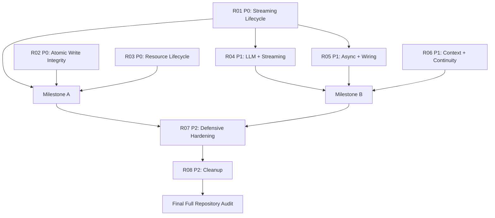

# LT Post-Phase-12 Remediation Program

> 当前正式计划：8 个 Phase，按 P0 Core Integrity、P1 Runtime Reliability、P2 Hardening &
> Slimming 组织。初始 13-Phase 计划已归档，不再用于执行。

## 1. Program Baseline

| Baseline | Value |
| --- | --- |
| Original Audit HEAD | `c94315e26cd4db3051f9f8af8ad5a3bdca0f7b8c` |
| Initial Planning HEAD | `b412b8b780395e7339fd29bcf612d8c0438bfc1d`（初始计划 commit） |
| R01 Start HEAD | `b412b8b780395e7339fd29bcf612d8c0438bfc1d` |
| R01 Implementation HEAD | `67ec88cc431cc8150f844b0397e72e1c0f201b9c` |
| Replanning Start HEAD | `4ca946fbcbab52100ed39463b249d2650c636d7c` |
| Replanning Docs Commit | The docs-only commit containing this plan (see Git history) |
| Branch / origin | `main`, 0 ahead / 0 behind at replanning start |
| Schema | 43 |
| Audit result | FAILED: B 1 / M 15 / N 20 / TG 15 / C 14 |
| R01 verification | format/analyze/diff-check PASS; targeted 35; full 1610; MUT-01...05 PASS |
| R01 status | `IMPLEMENTED`; Pending Independent Acceptance |

`4ca946f` 是重规划读取与代码复核基线；最终 docs commit 在完成后记录到 Git 历史。R01 的验收状态
没有因重规划改变。

## 2. Priority Model

| Priority | Definition | Program rule |
| --- | --- | --- |
| P0 Core Integrity | 确定性核心失败、数据丢失、DB/memory 分叉、编辑覆盖、资源身份或 delete/restore 生命周期破坏、持久状态卡死 | 下一轮大型功能开发前必须全部 `ACCEPTED` |
| P1 Runtime Reliability | 挂起、重试爆炸、协议错误传播、production/test wiring 分叉、stale async、错误资源操作、context/连续性失控 | 下一代角色/世界状态与权重架构前强烈要求全部 `ACCEPTED` |
| P2 Hardening & Slimming | migration/serialization 防御、损坏容忍、dead code、重复 helper、legacy cleanup | correctness 收敛后执行 |

Severity 描述单个缺陷后果；Priority 描述架构簇的修复时机。与 P0 根因同源的 MINOR 仍属于 P0，
不能按标签机械降级。

## 3. Milestones

### Milestone A - Core Integrity

包含 R01-R03。Exit：BLOCKER=0；所有涉及 data loss、commit boundary、resource identity、delete/restore、
persistent lifecycle 的 MAJOR 关闭；三个 P0 Phase 全部 `ACCEPTED`。达到后才建立新的核心数据正确性基线，
才允许下一轮大型功能开发。

### Milestone B - Runtime Reliability

包含 R04-R06。Exit：LLM transport 有界；streaming 错误 typed；production/test wiring 对齐；迟到响应
不能覆盖新状态；context 有界；narrative continuity 有生产路径回归测试。建议下一代状态/权重架构等待
此门通过。

### Milestone C - Hardening & Slimming

包含 R07-R08。Exit：防御性迁移与序列化验收；所有 cleanup 有 production reachability 证据；R01-R08
全部 `ACCEPTED`；随后执行 **Final Post-Remediation Full Repository Audit**。

## 4. New Phase Index

| Phase | Priority | Name | Findings | Dependencies | Status | Document |
| --- | --- | --- | --- | --- | --- | --- |
| R01 | P0 | Streaming Generation Lifecycle & Recovery | B1, M5, M6, N8, TG2, TG4, TG5 | - | `IMPLEMENTED`, acceptance pending | [R01](./remediation-phase-01-streaming-lifecycle-and-recovery.md) |
| R02 | P0 | Atomic Commit & Content Write Integrity | M1, M4, M7, M8, TG3, TG6-TG8 | - | `PLANNED` | [R02](./remediation-phase-02-atomic-write-integrity.md) |
| R03 | P0 | Resource Identity, Delete, Trash & Revision Lifecycle | M9, M11, M12, N4-N7, N14, TG9, TG10, CP-2 | - | `PLANNED` | [R03](./remediation-phase-03-resource-lifecycle-integrity.md) |
| R04 | P1 | LLM Transport & Streaming Protocol Reliability | M2, M3, M10, N15, TG1, TG13 | R01 `ACCEPTED` | `BLOCKED` | [R04](./remediation-phase-04-llm-streaming-reliability.md) |
| R05 | P1 | Async State & Production Wiring Consistency | M14, M15, N9-N13, TG11, TG12, TG14, C14 | R01 `ACCEPTED` | `BLOCKED` | [R05](./remediation-phase-05-async-wiring-consistency.md) |
| R06 | P1 | Context Budgeting & Narrative Continuity | M13, N18-N20, TG15 | - | `PLANNED` | [R06](./remediation-phase-06-context-budgeting-continuity.md) |
| R07 | P2 | Migration, Serialization & Defensive Hardening | N1-N3, N16, N17 | Milestones A+B | `BLOCKED` | [R07](./remediation-phase-07-migration-serialization-hardening.md) |
| R08 | P2 | Cleanup & Code Slimming | C1-C13 | R01-R07 `ACCEPTED` | `BLOCKED` | [R08](./remediation-phase-08-cleanup-code-slimming.md) |

## 5. Old to New Mapping

| Initial phase | Current phase | Architectural reason |
| --- | --- | --- |
| old R01 | R01 | 已实施历史，不重编号、不重写 |
| old R02 | R02-A | 对话不可逆提交是统一 commit boundary 的一个写入者 |
| old R03 | R02-B | Part CAS/压缩候选版本属于写入版本所有权 |
| old R07 | R02-C | autosave buffer/journal 是同一 durability contract 的前置写入层 |
| old R05 | R03-A/B/D | legacy/tree identity、删除与 retention 是一个资源生命周期 |
| old R06 | R03-C | revision restore 必须服从同一 trash 状态机 |
| old R04 | R04-A/B | transport timeout 与 retry budget 定义管线外层边界 |
| old R08 | R04-C/D | provider decode、consumer exception、patch protocol 是同一 streaming pipeline |
| old R09 | R05-A | async generation/ownership guards |
| old R11 | R05-B | production/test composition 与 controller ownership 同属 runtime wiring |
| old R10 | R06 | context budgeting 独立边界，避免与 DB lifecycle 混合 |
| old R12 | R07 | 防御性 migration/serialization hardening |
| old R13 | R08 | correctness 后统一 cleanup；C14 留在 R05 |

压缩结果：13 -> 8，减少 5 个 Phase（38.5%）。每个合并 Phase 以独立 workstream、targeted tests 和
acceptance criteria 保留故障定位能力。

## 6. Root Cause Map

| Root | Contract gap | Findings | Phase |
| --- | --- | --- | --- |
| RC-01 | streaming lifecycle 终态、失败收敛和启动恢复不一致 | B1, M5, M6, N8, TG2, TG4, TG5 | R01 |
| RC-02 | 不可逆写入缺少统一 commit/version/durability ownership | M1, M4, M7, M8, TG3, TG6-TG8 | R02 |
| RC-03 | legacy/tree identity 与 live/trash/gone/revision 状态机分裂 | M9, M11, M12, N4-N7, N14, TG9, TG10, CP-2 | R03 |
| RC-04 | HTTP/SSE/decode/consumer/parser 各层 timeout、retry、error ownership 分裂 | M2, M3, M10, N15, TG1, TG13 | R04 |
| RC-05 | async generation ownership 与 production/test composition 分叉 | M14, M15, N9-N13, TG11, TG12, TG14, C14 | R05 |
| RC-06 | context source、budget、summary coverage、history retention 口径不一 | M13, N18-N20, TG15 | R06 |
| RC-07 | migration 与 serialization 假设脆弱、单坏行放大 | N1-N3, N16, N17 | R07 |
| RC-08 | correctness 后残留不可达、重复与 legacy surface | C1-C13 | R08 |

R02 的三个 workstream 修改不同写入点但共享“不允许陈旧或未持久化状态被当成已提交”的 invariant；
R03 的四个 workstream共享同一资源 identity/state machine。它们相关度足够高，但实施与测试保持隔离，
不形成无法定位的大爆炸修改。

## 7. R01 Impact on Later Plans

R01 在 `67ec88c` 后建立了共享 `_StreamingGenerationInfrastructure`、
`streamingGenerationSessionRepositoryProvider`、`streamingResourceGenerationServiceProvider`，并让
`resourceStudioRuntimeProvider` 与 `sectionControlRuntimeProvider` 复用同一个 service/controller event
stream。`main.dart` 读取 `streamingGenerationRecoveryProvider`，以 `autoResume:false` 恢复持久中断会话；
controller 通过 `ownsService:false` 避免错误释放共享 service。生产装配测试证明这些 ownership 关系。

对旧 R08：retry/regeneration 失败现在会收敛到 `failed` 并发送 `GenerationFailed`，completed 可重新生成；
这些步骤从新 R04 删除。尚未完成的是 HTTP timeout/retry budget、provider decode 与 consumer exception
边界、typed patch failure 传播及真实 streaming protocol 测试，因此 M2/M3/M10/N15/TG1/TG13 仍在 R04。

对旧 R11：不再创建第二套 streaming session repository/service，也不再规划启动 recovery 接线；R05 必须
以 R01 共享 providers 为事实基础，守护 Studio、section control、startup 的相同实例关系。M15、TG11、
TG12、TG14 未被 R01 关闭，仍需 production-path convergence。

C14：`AdventureProvider._buildDefaultReadinessGate` 在当前代码中仍存在，注释明确其“without compression
hooks”，构造 coordinator 后也没有 `attachCompression`。因此未被 R01 关闭，映射 R05，不得降为 cleanup。

R01 顺带关闭了 C13 中 `_requestedStops` 泄漏这一子项（finally cleanup + mutation coverage）；C13 的其余
死赋值/自拷贝仍映射 R08。没有发现可将其它后续 finding 标记为 `CLOSED BY R01` 的充分代码/测试证据。

## 8. Dependencies and Execution Order

Technical dependency 与 recommended order 分离：R02、R03、R06 可技术上独立规划/实施；R04/R05 必须
等待 R01 `ACCEPTED`；R07 等待 A+B；R08 等待所有 correctness/hardening Phase。若仅一个 Agent，推荐
R01 acceptance -> R02 -> R03 -> R04 -> R05 -> R06 -> R07 -> R08，以减少共享文件冲突。

## 9. Finding Coverage Matrix

| Finding | Old Phase | New Phase | Priority | Status | Reason |
| --- | --- | --- | --- | --- | --- |
| B1 | R01 | R01 | P0 | IMPLEMENTED / acceptance pending | completed regeneration lifecycle |
| M1 | R02 | R02-A | P0 | MAPPED | dialogue atomic commit |
| M2 | R04 | R04-A | P1 | MAPPED | bounded transport timeout |
| M3 | R04 | R04-B | P1 | MAPPED | unified retry budget |
| M4 | R03 | R02-B | P0 | MAPPED | content CAS / lost update |
| M5 | R01 | R01 | P0 | IMPLEMENTED / acceptance pending | retry failure convergence |
| M6 | R01 | R01 | P0 | IMPLEMENTED / acceptance pending | startup recovery |
| M7 | R03 | R02-B | P0 | MAPPED | compression source version |
| M8 | R07 | R02-C | P0 | MAPPED | autosave durability |
| M9 | R06 | R03-C | P0 | MAPPED | revision obeys trash lifecycle |
| M10 | R08 | R04-C | P1 | MAPPED | consumer exception propagation |
| M11 | R05 | R03-A/B | P0 | MAPPED | legacy/tree deletion identity |
| M12 | R05 | R03-B/D | P0 | MAPPED | permanent delete cascade/retention |
| M13 | R10 | R06 | P1 | MAPPED | bounded context |
| M14 | R09 | R05-A | P1 | MAPPED | stale response ownership |
| M15 | R11 | R05-B | P1 | MAPPED | production revision wiring |
| N1 | R12 | R07-A | P2 | MAPPED | migration FK behavior |
| N2 | R12 | R07-B | P2 | MAPPED | corrupt row isolation |
| N3 | R12 | R07-A | P2 | MAPPED | migration idempotency |
| N4 | R05 | R03-A | P0 | MAPPED | identity contract |
| N5 | R06 | R03-C | P0 | MAPPED | restore state guard |
| N6 | R05 | R03-D | P0 | MAPPED | retention/cascade |
| N7 | R06 | R03-C | P0 | MAPPED | child restore semantics |
| N8 | R01 | R01 | P0 | IMPLEMENTED / acceptance pending | requested-stop cleanup |
| N9 | R09 | R05-A | P1 | MAPPED | async generation guard |
| N10 | R09 | R05-A | P1 | MAPPED | load/delete ordering |
| N11 | R09 | R05-A | P1 | MAPPED | double action/reentrancy |
| N12 | R09 | R05-A | P1 | MAPPED | dispose/late callback |
| N13 | R09 | R05-A | P1 | MAPPED | wrong-resource async write |
| N14 | R05 | R03-D | P0 | MAPPED | orphan auxiliary state |
| N15 | R08 | R04-D | P1 | MAPPED | streaming/non-stream protocol divergence |
| N16 | R12 | R07-C | P2 | MAPPED | stable enum/JSON decoding |
| N17 | R12 | R07-C | P2 | MAPPED | consistent unknown-value policy |
| N18 | R10 | R06-A | P1 | MAPPED | single-source injection |
| N19 | R10 | R06-B | P1 | MAPPED | summary/history coverage |
| N20 | R10 | R06-C | P1 | MAPPED | token estimator consistency |
| TG1 | R08 | R04-D | P1 | MAPPED | production-shape streaming fake |
| TG2 | R01 | R01 | P0 | IMPLEMENTED / acceptance pending | lifecycle regression |
| TG3 | R02 | R02-A | P0 | MAPPED | post-commit cancellation race |
| TG4 | R01 | R01 | P0 | IMPLEMENTED / acceptance pending | failure convergence regression |
| TG5 | R01 | R01 | P0 | IMPLEMENTED / acceptance pending | startup recovery wiring |
| TG6 | R03 | R02-B | P0 | MAPPED | generation CAS race |
| TG7 | R03 | R02-B | P0 | MAPPED | compression stale candidate |
| TG8 | R07 | R02-C | P0 | MAPPED | journal failure durability |
| TG9 | R06 | R03-C | P0 | MAPPED | revision/trash regression |
| TG10 | R05 | R03-A/B/D | P0 | MAPPED | legacy delete/cascade regression |
| TG11 | R11 | R05-B | P1 | MAPPED | adventure production wiring |
| TG12 | R11 | R05-B | P1 | MAPPED | import real write path |
| TG13 | R04 | R04-A/B | P1 | MAPPED | timeout/retry multiplication |
| TG14 | R11 | R05-B | P1 | MAPPED | prompt/consumer contract |
| TG15 | R10 | R06 | P1 | MAPPED | continuity production path |
| C1 | R13 | R08 | P2 | MAPPED | scene-approval orphan cluster |
| C2 | R13 | R08 | P2 | MAPPED | context compressor reachability |
| C3 | R13 | R08 | P2 | MAPPED | dead navigation/state |
| C4 | R13 | R08 | P2 | MAPPED | duplicate preset manager |
| C5 | R13 | R08 | P2 | MAPPED | dead multi-character accessors |
| C6 | R13 | R08 | P2 | MAPPED | unreachable scheduler branch |
| C7 | R13 | R08 | P2 | MAPPED | import dead parameter; coordinate with R05 |
| C8 | R13 | R08 | P2 | MAPPED | duplicate viewport helper |
| C9 | R13 | R08 | P2 | MAPPED | stale comments |
| C10 | R13 | R08 | P2 | MAPPED | LLM unreachable branches |
| C11 | R13 | R08 | P2 | MAPPED | dead methods |
| C12 | R13 | R08 | P2 | MAPPED | disabled toast |
| C13 | R13 | R08 | P2 | PARTIAL CLOSED BY R01 | `_requestedStops` closed; remaining dead assignments stay R08 |
| C14 | R11 | R05-B | P1 | MAPPED | fallback gate still lacks compression |

Coverage audit: B 1/1; M 15/15; N 20/20; TG 15/15; C 14/14. **Unmapped Findings: 0.**
CP-2 是旧计划的 cross-phase contract，映射 R03-C，不计入原审计 65 项分母。

## 10. Global Quality and Acceptance Gates

每阶段由 Implementation Agent 实施后标记 `IMPLEMENTED`，再由独立 Acceptance Agent 根据当前代码、
commit diff、production path 和 mutation 证据裁决。合并阶段不取消独立验收。

- P0：targeted regressions、full `flutter test`、`flutter analyze`、format、`git diff --check`、mutation/
  negative tests；DB/concurrency 必须有真实 transaction/race/production-wiring 验证。
- P1：targeted、full regression、production-path tests；timeout/error/ownership 等关键 contract 做 mutation。
- P2：full regression；migration fixtures；cleanup 做宽/窄引用、Git history、serialization/migration/dynamic
  reachability 审计。单独 `rg` 无引用不是删除依据。
- 每个 Phase 只修改文档规定边界；新 finding 记录并映射，不顺手扩 scope。

Program 最终 Exit：R01-R08 全部 `ACCEPTED`；schema/migration 与跨平台风险受控；全部 finding 有关闭
证据；执行 Final Post-Remediation Full Repository Audit 并独立记录结论。

## 11. Non-Goals and Rollback

不引入角色/世界状态、权重管理或其它新功能；不大规模重写 Assembly；不为压缩阶段而混合无关事务
模型。每个 workstream 采用聚焦 commit，失败通过 `git revert <commit>` 恢复；禁止 reset/force push；
数据库变更必须前向兼容、事务化并以旧 fixture 验证。
