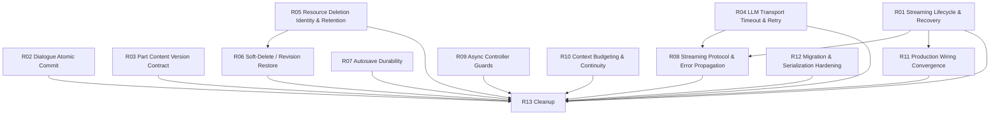

# LT Post-Phase-12 Remediation Program

> 本文件是 LT 在 Phase 0–12 完成后的**缺陷修复总计划书**。它是
> [`LT Post-Phase-12 Full Repository Audit`](#2-audit-baseline) 的正式工程化落地：把审计发现按
> **根因 / 架构边界**重新组织为可独立实施、独立验收的 Remediation Phase。
>
> 本 Program 不引入新功能。所有 Phase 只做生产正确性、数据完整性、并发/生命周期、Resilience、
> 测试架构与代码瘦身。

---

## 1. Program Background

- Phase 0–12（Adaptive Resource System）已经完成并通过各自验收，HEAD `c94315e`，工作树 clean。
- 在此之后执行了一次**独立全项目审计**（只读、攻击性、以代码为准），结论为 **FAILED**：
  存在 1 个确定性 BLOCKER、15 个 MAJOR、20 个 MINOR、15 个 TEST-GAP、14 个 CLEANUP。
- 审计表明：**`flutter analyze` 全绿 + 1600 个测试全绿，并不能覆盖真实生产路径**。缺陷集中在
  测试盲区（流式分支、取消时序、旧数据删除生命周期、软删除语义、生产装配分叉）。
- 因此不适合“零散修 BUG”：
  1. 多个 BUG 共享同一根因（例如 `completed` 终态同时导致 B1/M5/M6）；逐 BUG 修会留下系统性问题。
  2. 修复会跨 Repository / Service / Provider / DB / UI 多层，需要统一的 contract 边界与回归测试。
  3. 未经规划的顺序修复容易一边删代码一边改生产，放大风险。
- 本 Program 的目标是：让**任意一个未参与 Phase 0–12、未读审计全文的 Coding Agent**，仅凭一份
  Phase 文档 + 当前仓库即可正确实施并独立验收。

## 2. Audit Baseline

```text
Audit HEAD (被审计的真实代码):  c94315e26cd4db3051f9f8af8ad5a3bdca0f7b8c
Planning HEAD (撰写本计划时):    c94315e26cd4db3051f9f8af8ad5a3bdca0f7b8c
Branch:                          main
origin/main:                     c94315e (0 ahead / 0 behind)
Worktree:                        clean
Schema Version:                  43 (DatabaseService.schemaVersion)
Flutter:                         3.44.8 stable
Dart:                            3.12.2
Audit Result:                    FAILED
                                 BLOCKER 1 / MAJOR 15 / MINOR 20 / TEST-GAP 15 / CLEANUP 14
```

Planning HEAD == Audit HEAD，无差异。所有 Phase 文档中的 `file:line` 以该 commit 为基线；若执行
时 line 漂移，**以 symbol 为准**。

审计验证基线（真实执行结果，供 Program 结束复现对比）：

```text
dart format --output=none --set-exit-if-changed .   : PASS (493 files, 0 changed)
flutter analyze                                     : PASS (No issues found)
flutter test                                        : PASS (1600 passed, 0 failed, 0 skipped)
git diff --check                                    : clean
```

## 3. Program Objectives

1. **消除确定性生产 BUG**：B1（已完成章节重新生成必然失败）等。
2. **修复数据一致性问题**：对话提交/取消分叉（M1）、Part 内容写入丢失更新（M4）、过期压缩候选
   覆盖（M7）、旧数据删除/重建失效（M11/M12）、revision 恢复违反软删除语义（M9）。
3. **修复生命周期与并发边界**：流式会话终态与恢复（M5/M6）、自动保存批次原子性（M8）、异步控制器
   迟到响应（M14）。
4. **消除生产 wiring 与测试 wiring 分叉**：CRUD 保存缺 revision capture（M15）、冒险启动链与流式
   分支仅测试侧装配（TG1/TG11/TG12）。
5. **建立关键 failure path 回归测试**：TG1–TG15 全部闭合或明确判定无需测试。
6. **在 correctness 稳定后清理 dead code**：C1–C14（Phase 13，最后执行）。

## 4. Non-Goals

本 Program **不负责**以下内容（属于 Post-Remediation Feature Development，禁止顺手加入）：

- 新的角色状态 / 世界状态系统重构；
- 权重管理、角色卡时间线、世界观变迁 UI；
- Assembly 下一代重构或资源模型重新设计；
- 任何新 Provider / 新页面 / 新业务能力；
- 大规模架构重写（除为满足本 Program contract 的最小必要改动外）；
- 删除仍被 migration / serialization / dynamic / DB 兼容依赖的代码（Phase 13 需逐项复核后才能删）。

## 5. Root Cause Map

> 覆盖全部 B / M / N / TG / C。`C14` 归入 R11（wiring），`C1–C13` 归入 R13（cleanup）。

| Root ID | Root Cause（架构边界） | Findings | Risk | Phase |
| --- | --- | --- | --- | --- |
| RC-01 | 流式生成会话把 `completed` 定义为不可逆终态，与“可重新生成/可恢复”的产品 contract 冲突；`retryPart` 无异常收敛；中断会话无启动恢复入口 | B1, M5, M6, N8, TG2, TG4, TG5 | BLOCKER / 数据可恢复性 | R01 |
| RC-02 | 对话的**唯一不可回退 DB 提交**发生在取消校验之后，却在校验失败时执行“回滚内存” | M1, TG3 | MAJOR / DB↔UI 分叉 | R02 |
| RC-03 | 写入 `resource_parts.content` 的两个“非显式编辑”写者（生成提交、压缩发布）缺少对当前内容的版本/CAS 校验 | M4, M7, TG6, TG7 | MAJOR / 丢失更新 | R03 |
| RC-04 | LLM 传输层无超时；重试在 `LLMService` 与 `AiGeneratorService` 两层叠加并被外层内容循环再乘 | M2, M3, TG13 | MAJOR / 挂起与成本 | R04 |
| RC-05 | `LegacyCreationBridge` 让树资源 id 复用旧行 id 却不记录 identity 关系；软删除与永久删除只作用于树行，旧行/辅助表残留 | M11, M12, N4, N6, N14, TG10 | MAJOR / 删除失效与孤儿数据 | R05 |
| RC-06 | revision restore / 子节点 restore 只看 token 与父行存在性，不看 `deleted_at`，会复活或悬挂软删除节点 | M9, N5, N7, CP-2 | MAJOR / 状态不一致 | R06 |
| RC-07 | `ResourceAutosaveService.flush` 假设 `_writeOne` 不抛；journal 写失败后 in-memory 编辑被永久丢弃 | M8, TG8 | MAJOR / 数据丢失 | R07 |
| RC-08 | 流式协议消费者（parser/validator）异常被 `LLMService` 的 `catch (_)` 吞掉；生产走流式分支而测试永远走非流式 | M10, N15, TG1 | MAJOR / 错误被掩埋 + 测试失真 | R08 |
| RC-09 | Studio 容量/版本控制器与若干异步控制器缺少请求代际/重入守卫，迟到响应可驱动对错误资源的写 | M14, N13, N9, N10, N11, N12 | MAJOR / 错误写与 UI 分叉 | R09 |
| RC-10 | 上下文预算与连续性：详细世界观生产路径无界注入源文本；摘要窗口与裁剪不同步；token 估算与中文字符计数口径不一致 | M13, N18, N19, N20, TG15 | MAJOR / 上限与连续性 | R10 |
| RC-11 | 生产装配分叉：CRUD 保存链未接入 revision capture；冒险启动链与流式分支仅测试装配；测试用死参数提供假保证 | M15, TG11, TG12, TG14, C14 | MAJOR / 测试≠生产 | R11 |
| RC-12 | 迁移/序列化健壮性：迁移期 `PRAGMA foreign_keys=OFF` 是事务内无效操作；非幂等数据迁移步骤；库读取吞异常；枚举按序数序列化 / 解析策略不一致 | N1, N2, N3, N16, N17 | MINOR / 潜伏 | R12 |
| RC-13 | Phase 12 后残留死代码与技术债 | C1–C13 | 维护风险 | R13 |

## 6. Phase Index

| Phase | Name | Root Cause | Findings | Depends On | Risk | Document |
| --- | --- | --- | --- | --- | --- | --- |
| R01 | Streaming Generation Lifecycle & Recovery | RC-01 | B1, M5, M6, N8, TG2, TG4, TG5 | None | BLOCKER | [phase-01](./remediation-phase-01-streaming-lifecycle-and-recovery.md) |
| R02 | Dialogue Atomic Commit & Cancellation Boundary | RC-02 | M1, TG3 | None | MAJOR | [phase-02](./remediation-phase-02-dialogue-atomic-commit-cancellation.md) |
| R03 | Part Content Write Conflict & Version Contract | RC-03 | M4, M7, TG6, TG7 | None | MAJOR | [phase-03](./remediation-phase-03-part-content-write-version-contract.md) |
| R04 | LLM Transport Timeout & Retry Policy | RC-04 | M2, M3, TG13 | None | MAJOR | [phase-04](./remediation-phase-04-llm-transport-timeout-retry.md) |
| R05 | Resource Deletion Identity, Cascade & Retention | RC-05 | M11, M12, N4, N6, N14, TG10 | None | MAJOR | [phase-05](./remediation-phase-05-resource-deletion-identity-and-retention.md) |
| R06 | Soft-Delete ↔ Revision/Restore Semantics | RC-06 | M9, N5, N7, CP-2 | R05（共享软删除语义） | MAJOR | [phase-06](./remediation-phase-06-soft-delete-revision-restore-semantics.md) |
| R07 | Autosave Durability & Failure Isolation | RC-07 | M8, TG8 | None | MAJOR | [phase-07](./remediation-phase-07-autosave-durability-failure-isolation.md) |
| R08 | Streaming Protocol Integrity & Consumer Error Propagation | RC-08 | M10, N15, TG1 | R01, R04（共享流式/传输代码） | MAJOR | [phase-08](./remediation-phase-08-streaming-protocol-error-propagation.md) |
| R09 | Async Controller Stale-Response & Reentrancy Guards | RC-09 | M14, N13, N9, N10, N11, N12 | None | MAJOR | [phase-09](./remediation-phase-09-async-controller-stale-response-guards.md) |
| R10 | Context Budgeting & Continuity | RC-10 | M13, N18, N19, N20, TG15 | None | MAJOR | [phase-10](./remediation-phase-10-context-budgeting-and-continuity.md) |
| R11 | Production Wiring & Test Architecture Convergence | RC-11 | M15, TG11, TG12, TG14, C14 | R01（recovery 装配点） | MAJOR | [phase-11](./remediation-phase-11-production-wiring-convergence.md) |
| R12 | Migration & Serialization Hardening | RC-12 | N1, N2, N3, N16, N17 | None | MINOR | [phase-12](./remediation-phase-12-migration-serialization-hardening.md) |
| R13 | Cleanup & Code Slimming | RC-13 | C1–C13 | R01–R12 全部 ACCEPTED | CLEANUP | [phase-13](./remediation-phase-13-cleanup-and-code-slimming.md) |

## 7. Dependency Graph



### 依赖说明（为什么存在）

- **R01 → R08**：两者都修改 `streaming_resource_generation_service.dart` 与
  `part_generation_coordinator.dart`。R01 先确定“会话在失败/中断后应落到哪个可恢复状态”这一
  contract，R08 的消费者错误上报必须复用该收敛路径。若并行修改同一文件将产生冲突且语义不一致。
- **R04 → R08**：两者都修改 `llm_service.dart`。R04 先定义传输层超时与重试语义，R08 再分离
  “provider 事件解码错误”与“消费者异常”，避免两种错误处理互相覆盖。
- **R05 → R06**：R06 需要 R05 提供的统一“节点是否被软删除”判定与旧行 identity 关系（`deleted_at`
  与 `resource_migration_records` 的权威查询），否则 revision restore 无法判断资源是否在回收站。
- **R01 → R11**：R11 需要把 R01 新增/暴露的启动恢复入口接线到生产装配，并让测试走同一路径。
- **R13 依赖全部**：只有在 correctness 阶段全部 ACCEPTED 后，才允许删除代码，避免“边删边修”。

### 可并行执行的阶段

- R02、R04、R07、R12 与 R01 互相独立，可并行。
- R03 与 R05 互相独立，可并行。
- R09、R10 与其余 correctness 阶段独立，可并行。
- R11 需 R01 完成后开始。R13 需全部完成。

## 8. Recommended Execution Order

排序依据：BLOCKER → 数据丢失/一致性 → 生命周期/并发 → 网络/Resilience → production wiring →
test architecture → minor robustness → cleanup。同时把“会被后续多个 Phase 依赖的底层 contract”
提前。

```text
Wave 1（BLOCKER + 关键数据一致性）
  R01  Streaming Generation Lifecycle & Recovery      ← BLOCKER，且是 R08/R11 的前置 contract
  R02  Dialogue Atomic Commit & Cancellation Boundary  （可并行）

Wave 2（数据一致性 / 完整性）
  R03  Part Content Write Conflict & Version Contract  （可并行）
  R05  Resource Deletion Identity, Cascade & Retention （可并行）
  R07  Autosave Durability & Failure Isolation         （可并行）

Wave 3（lifecycle / concurrency）
  R06  Soft-Delete ↔ Revision/Restore Semantics        （依赖 R05）
  R09  Async Controller Stale-Response & Reentrancy Guards

Wave 4（Resilience + 流式协议）
  R04  LLM Transport Timeout & Retry Policy
  R08  Streaming Protocol Integrity                    （依赖 R01、R04）

Wave 5（上下文 + wiring + robustness）
  R10  Context Budgeting & Continuity
  R11  Production Wiring Convergence                   （依赖 R01）
  R12  Migration & Serialization Hardening

Wave 6（收敛）
  R13  Cleanup & Code Slimming                         （依赖全部 ACCEPTED）
```

> 每个 Wave 内部可并行；Cross-Wave 依赖见 §7。任何 Phase 完成必须更新 `STATUS.md`。

## 9. Cross-Phase Contracts（全程不得破坏的不变量）

整个 Program 期间，以下不变量必须保持；任何 Phase 的修改都不得违反：

1. **Resource Tree identity**：`resources` 主键不可变；树节点删除为软删除（`deleted_at`），
   软删除行占用主键。任何 identity 关系（旧行 ↔ 树行）必须可查询、可幂等重建。
2. **Revision semantics**：每次覆盖既有内容前，必须能在同一事务内记录 `latestHead` 前态；
   `is_head=1` 的 revision 只能有一个；revision 必须可从 delta 链精确重建。
3. **Soft-delete semantics**：`deleted_at != null` 表示“在回收站可用 `restore` 恢复”，
   **不等于**“永久不存在”。任何“查找 live 状态”的查询必须显式声明是否包含软删除行。
4. **Attempt / lease semantics**：任何提交必须携带当前 attempt token 并在事务内校验；lease
   过期才可被新 attempt 取代；旧 attempt / 旧 generation 的迟到结果不得提交。
5. **Assembly snapshot semantics**：ready assembly 是从 published revision 重建的**快照**，
   不得引用 live 树内容；后续编辑只能标记 stale，不得改变已生成 assembly。
6. **LLM transport semantics**：所有 chat 调用经统一 `LlmService`；必须有一次可界定的超时；
   重试预算只有一个 transport 层 + 一个 content 层；取消不得被重试。
7. **Fail-closed**：parser/validator/DB 校验失败时必须拒绝提交，不得写入部分内容；不得用空
   `catch`、无限重试、无意义 fallback 掩盖。
8. **Production wiring == test wiring**：任何生产 provider 装配路径必须有至少一个使用同一装配
   （无 override）的装配级测试；反之测试使用的 fake 不得与生产实现语义分叉。

## 10. Global Verification

每个 Phase 必须执行：

```bash
dart format --output=none --set-exit-if-changed .
flutter analyze
flutter test <target tests>
flutter test
git diff --check
git status --short
```

涉及 DB migration 的 Phase（R05、R06、R12）额外要求：

```bash
flutter test test/application/resources/database_migration_v36_test.dart
flutter test test/application/resources/database_migration_v39_test.dart
flutter test test/application/resources/database_migration_v40_test.dart
flutter test test/application/resources/database_migration_v41_test.dart
flutter test test/application/resources/database_migration_v42_test.dart
flutter test test/services/database_migration_v38_test.dart
flutter test test/services/database_migration_resource_tree_test.dart
```

所有 Phase 完成后，Program 级收尾必须重新执行一次**独立全项目复审**：

> `Post-Remediation Full Repository Audit`，使用与本次审计相同的只读、攻击性方法，并验证
> §11 Exit Criteria。

## 11. Exit Criteria

Program 只有满足全部条件才可关闭：

```text
1. BLOCKER = 0
2. MAJOR = 0
3. 所有原 BLOCKER / MAJOR：
   - 有对应修复 commit（一个逻辑任务一个 commit）
   - 有对应 regression test（能在 mutation 下失败）
   - 有独立验收记录（ACCEPTED）
4. 关键 TEST-GAP（TG1–TG15）：已闭合，或明确记录“无需测试”的理由并被独立复核
5. 生产 wiring == 测试 wiring（§9.8 有装配级测试证据）
6. C1–C14：已删除并复核无 dynamic/serialization/migration 依赖，或明确 DEFERRED（记录理由）
7. 全量：dart format 0 changed、flutter analyze 0 issues、flutter test 全通过、git diff --check clean
8. 最终独立全项目复审结论为 PASSED 或 PASSED WITH NON-BLOCKING FINDINGS
```

## 12. Program Status

统一状态见 [`STATUS.md`](./STATUS.md)。状态枚举：

```text
PLANNED → IMPLEMENTING → IMPLEMENTED → AUDITING → ACCEPTED / FAILED
BLOCKED（前置未 ACCEPTED 时禁止开始）
```

本计划书对应 `STATUS.md` 中 `remediation-master-plan.md` 一行；各 Phase 独立一行。

## 13. Stop Condition

本文件与各 Phase 文档仅用于规划。规划完成后**不得**直接开始实施；由后续 Coding Agent 按
`STATUS.md` 中的 `Next Phase` 逐一执行。第一个待实施阶段见 `STATUS.md`。
