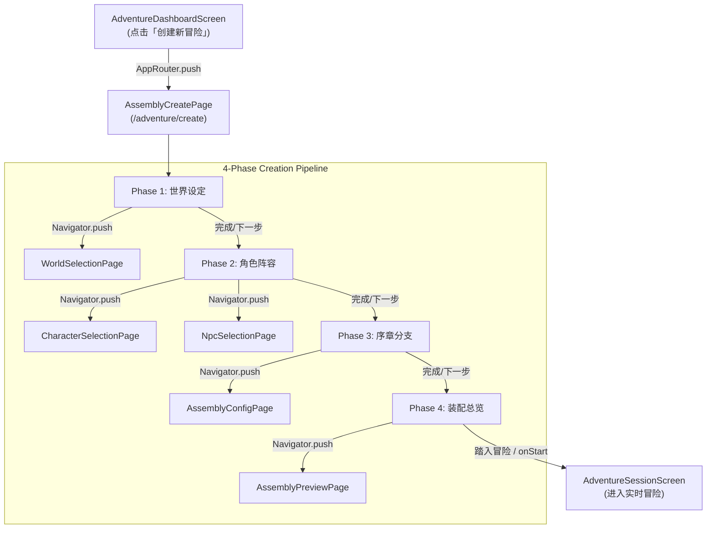

# R02-C Assembly Module Navigation Migration Report

> 本文档记录 LT 项目 R02 导航优先重构（Navigation-first UI Architecture Refactor）的第三阶段实施成果：组装模块（Assembly / Creation Pipeline）页面化重构、通用资源选择器及旧 Dialog/Popup 驱动流的彻底解耦。

---

## 1. Baseline

- **Base Commit**: `45fa869` (`feat(ui): migrate resource creation flow to pages`)
- **Flutter SDK**: Flutter 3.44.8 stable / Dart 3.12.2
- **规划依据**: `docs/ui-refactor/r02-navigation-first-ui-plan.md`、`docs/ui-refactor/r02-a-ui-foundation-implementation.md` 及 `docs/ui-refactor/r02-b-resource-library-migration.md`
- **实施边界**: STRICT 严格范围控制：只处理组装流程 UI（Creation Pipeline UI），不修改数据库 schema、不修改 `AdventureConfig` 结构与序列化协议、不修改 LLM 调用与对话引擎，实现从弹窗/浮层驱动向 Navigation-first 页面架构的无缝跃迁。

---

## 2. Migrated Flows & New Pipeline Pages

本阶段针对冒险组装流水线（Worldview -> Characters/NPCs -> Prologue/Branches -> Overview）构建了完整的 Navigation-first 页面栈：

| 页面 / 模块 | 职责与定位 | 核心特性与组件 | 消除的旧交互模式 |
|---|---|---|---|
| **`AssemblyCreatePage`** | 组装管线主控制器（Orchestrator） | 4 阶段步进导航（世界设定、角色阵容、序章分支、装配总览）；采用 `AppPageScaffold` + `AppCard` + 阶段进度指示；支持从各步骤一键跳转子页面 | 消除杂糅在单屏超长滚动中的弹窗与脆弱状态 |
| **`ResourceSelectionPage<T>`** | 通用资源选择基础设施页面 | 泛型搜索、多分类 Chip 过滤、单选/多选底栏、`AppLoadingView` / `AppEmptyView` / `AppErrorView`；提供实时搜索过滤与高亮选定 | 消除各种零散、尺寸受限的 Dialog 与 BottomSheet 选人列表 |
| **`WorldSelectionPage`** | 世界观专属选择页面 | 基于 `ResourceSelectionPage`；自动按世界观分类（全部、预置、自定义）；展示地理规则与描述 | 消除世界观下拉弹窗与受限的选择浮层 |
| **`CharacterSelectionPage`** | 角色阵容专属选择页面 | 基于 `ResourceSelectionPage`；集成 `WorldviewCharacterScopePolicy` 兼容性（当前世界、未绑定、跨世界）；多选主控主角与同行同伴 | 消除角色选择 Dialog 及小屏展示溢出 |
| **`NpcSelectionPage`** | 常驻 NPC 专属选择页面 | 基于 `ResourceSelectionPage`；展示 NPC 专属标签与描述；支持快速批量勾选与快照注入 | 消除 NPC 模态弹窗与复杂嵌套 |
| **`AssemblyConfigPage`** | 序章剧情与分支配置独立页面 | 包含序章背景剧情富文本、3 个行动决策分支、叙事难度选择 (`AppSelect<AdventureDifficulty>`)、生成引导提示词等 | 消除嵌套在 Wizard 中的折叠表单与受限输入框 |
| **`AssemblyPreviewPage`** | 装配就绪检查与启动总览页面 | 汇聚世界观、主角、同行队伍、角色间羁绊关系、常驻 NPC、序章开场与行动决策分支；提供「踏入冒险」最终触发与字段校验 | 消除底部遮挡弹窗，全屏卡片式核验 |

---

## 3. Navigation Architecture

### 路由流向设计

### 路由注册与平滑兼容

在 `lib/core/router/app_router.dart` 中注册了：
- `/adventure/create`: 组装创建主入口
- `/adventure/wizard`: 历史别名路由兼容
- `/adventure/assembly`: 语义化别名路由

同时对现有 `AdventureWizardScreen` 与 `AdventureDashboardScreen` 保持 100% 兼容，Dashboard 的创建按钮无缝接入 `AssemblyCreatePage`，旧向导界面作为后备实现与回归测试基线完全保留。

---

## 4. Responsive & Small Screen Layout (320px Hard Gate)

所有新页面严格遵循 `AGENTS.md` 响应式与小屏规范：

1. **最低兼容逻辑宽度**: `320px`（验证 `tester.view.physicalSize = const Size(320, 568)`）。
2. **弹性布局**: 全面使用 `Wrap`、`Column`、`Flexible`、`Expanded`，拒绝固定宽度的横向 `Row` 按钮组。
3. **输入与键盘安全**: 所有表单采用带有滚动边界的 `ListView` / `SingleChildScrollView`，底部动作栏配合 `SafeArea(top: false)` 保证不与系统交互区重叠。
4. **无 RenderFlex Overflow**: 经过多尺寸（320px、360px、390px）严苛 Widget 测试，`tester.takeException() == null`。

---

## 5. Tests Verification

新增专属 Widget 测试套件：`test/widget/assembly_navigation_test.dart`。

包含 **10 个针对性测试用例**：
1. **Pipeline 基础**:
   - `AssemblyCreatePage renders Phase 1 Worldview selection on entry`
   - `AssemblyCreatePage validates worldview selection before advancing to Phase 2`
   - `AssemblyCreatePage validates at least one character in Phase 2`
   - `Full pipeline navigation from Phase 1 to Phase 4 and start`（全管线贯穿验证：选世界 -> 选角色 -> 选 NPC -> 编序章 -> 启动）
2. **独立子页面功能**:
   - `AssemblyConfigPage validates inputs and returns updated config`
   - `AssemblyPreviewPage displays complete overview and launches`
   - `ResourceSelectionPage Search query filters items in real time and clears`
3. **响应式硬门槛 (320px, 360px, 390px)**:
   - `AssemblyCreatePage renders without overflow on 320x568`
   - `AssemblyCreatePage renders without overflow on 360x640`
   - `AssemblyConfigPage and AssemblyPreviewPage render without overflow on 390x844`

### 回归测试与静态分析结果

- `dart analyze`: **0 issues found!**
- `dart format`: **All files formatted.**
- `test/widget/assembly_navigation_test.dart`: **10/10 passed**
- `test/widget/adventure_wizard_responsive_test.dart`: **Passed**
- `test/widget/p0_adventure_wizard_loading_test.dart`: **Passed**
- `test/widget/p0_adventure_wizard_start_boundary_test.dart`: **Passed**
- `test/widget/adventure_dashboard_widgets_test.dart`: **Passed**
- `test/architecture/presentation_boundary_test.dart`: **Passed**

---

## 6. Risks Assessment & Residual Risks

- **数据库安全性**: 本轮变更仅涉及 `lib/features/adventure/presentation/wizard/screens/` 与路由映射，零 SQLite 迁移，零数据损毁风险。
- **业务状态连续性**: `AdventureConfig` 构建与 `AdventureSetupController` 数据源完全沿用已有成熟逻辑。
- **剩余风险**:
  - 当前主流程已全面优先导向 `AssemblyCreatePage`，后续 R02-D 可推进更多历史复杂 Dialog（如设置、存档导入导出、世界观深度编辑等）向独立页面架构演进。
