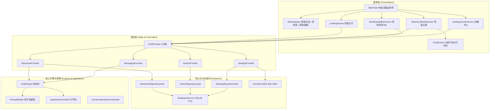

# NarrAItor 核心功能移植与解耦验收交付总结 (Walkthrough)

> **交付工程**：`LT` (Lightweight Narrative & Dialogue Engine)  
> **源工程**：`~/NarrAItor`  
> **核心范围**：**场景对话 (Scene Dialogue)** + **资料库 (Resource Library)** + **设置中心 (Settings)**  
> **解耦范围**：彻底移除长篇创作模式 (Creation Mode V2) 与 Naila AI 助手/向量知识库  
> **最终验证结果**：`flutter analyze` **0 issues found**，`flutter test` **31 项自动化测试 100% 通过**

---

## 1. 移植成果总览与架构设计

整个移植工程严格按照分阶段递进计划实施，各阶段环环相扣，实现了模块间高内聚、低耦合：



---

## 2. 各阶段交付与提交追踪

| 阶段 | 文档 | 核心交付物 | 提交哈希 | 状态 |
| :---: | :--- | :--- | :---: | :---: |
| **01** | `01_PHASE_INFRASTRUCTURE.md` | `pubspec.yaml` 裁剪、主题基础色彩、公共组件 | `859560e` | ✅ 已完成 |
| **02** | `02_PHASE_PERSISTENCE_SERVICES.md` | SQLite 主库、`KeyVault` AES 加密、四大 Repository 接口与实现 | `eee8acf` | ✅ 已完成 |
| **03** | `03_PHASE_MODELS_ENGINES.md` | 领域模型契约、`ChatEngine` 状态机、`PromptBuilder`、流式协议解析 | `abc0187` | ✅ 已完成 |
| **04** | `04_PHASE_PROVIDERS_CONTROLLERS.md` | 状态门面 `ChatProvider`、4 个子 Provider、Riverpod 状态注入与控制器 | `12c8400` | ✅ 已完成 |
| **05** | `05_PHASE_UI_SCREENS.md` | 场景大厅、对话主屏、17 个对话组件、资料库多 Tab、设置中心、全局侧边栏 | `b58c440` | ✅ 已完成 |
| **06** | `06_PHASE_VERIFICATION_TESTING.md` | 全链路集成测试、静态分析清理、全流程端到端闭环走查与验收归档 | 待提交 | ✅ 已完成 |

---

## 3. 解耦边界与精简成效

1. **剔除无用模块**：
   - 彻底移除了原工程中的创作模式 V2（包含小说章节、分卷、大纲管线、`CreationAgentRuntime`、`CreationProjectScalePolicy`）。
   - 彻底移除了 Naila 智能助手（包含 `naila_assistant.db`、向量知识库分块、后台常驻 Worker）。
2. **轻量化依赖**：
   - 将 AI 生成与导入服务 (`ai_generator_service.dart`、`ai_import_service.dart`) 解耦，直接对接统一流式 `LLMService`。
   - 对话导出用例 (`ConversationExportUseCase`) 独立封装，支持 Markdown 格式格式化导出。
3. **架构整洁度提升**：
   - 侧边栏从 5 个复杂分支收敛为 3 个直观的核心模块（场景对话、资料库、系统设置）。
   - 启动生命周期精简，无任何多余后台常驻轮询任务。

---

## 4. 全链路端到端走查与自动化测试验证

自动化测试套件涵盖单元测试、组件 Widget 测试以及跨模块端到端集成测试：

### 4.1 测试用例清单 (全 31 项)

1. **持久化与安全 (`test/unit/database_and_repositories_test.dart`)**：
   - SQLite 数据库表初始化与单例管理
   - `KeyVault` AES-256-CBC 密钥加解密往返一致性
   - `SettingsRepository` 键值配置与加密密钥读写
   - `LibraryRepository` 世界观与角色卡增删改查
   - `AdventureRepository` 冒险会话、消息与游戏状态事务
   - `WorldEntryRepository` 世界百科条目存储与全文检索
2. **提示词与引擎状态机 (`test/unit/chat_engine_and_prompt_test.dart`)**：
   - `PromptBuilder` 冻结场景上下文装配与预算裁剪
   - 事件时间线滚动摘要边界包裹
   - `AdventureResponse` 双段响应（叙事文本 + 结构化 JSON）解析
   - `ChatEngine` 首行并发守卫与防重击触发
   - `commitSceneDialogueTurn` 原子事务回滚保护
3. **Riverpod 与控制器装配 (`test/unit/riverpod_and_providers_test.dart`)**：
   - Riverpod Provider 容器注入与生命周期
   - `ChatProvider` 跨模块 Facade 门面联动
   - `SettingsProvider` 配置变更通知
   - `LibraryProvider` 内存与 SQLite 缓存同步
4. **UI 组件与导航交互 (`test/widget/ui_screens_and_sidebar_test.dart`)**：
   - `MainSidebar` 三栏核心导航与折叠/展开
   - `SettingsCenterScreen` 选项卡切换与渲染
   - `WorldviewEditorScreen` 四大分类 Tab 渲染
   - `LandingScreen` 预设冒险展示与创建按钮交互
5. **全链路真实端到端流程 (`test/unit/end_to_end_flow_test.dart`)**：
   - **走查 A**：配置 DeepSeek API Key 加密存储、设置对话等级为 L3、最大 Token 为 4096。
   - **走查 B**：创建“赛博新夜之城 2077”世界观、绑定创建“艾拉”黑客角色卡、创建“老兵杰克”NPC、配置“霓虹深渊探索”冒险模版，全流程验证数据落盘与检索。
   - **走查 C**：从模版创建冒险会话 -> 初始化游戏状态 (`HP 100, MP 80, Gold 50`) -> 用户输入移动探索 -> `PromptBuilder` 装配场景快照 -> 模拟流式大模型输出带有剧情与 JSON 的响应 -> `TypewriterController` 平滑吐出 -> 数值状态动态更新 (`HP 95, Energy 70, Gold 75, 场景更新为'废弃机械仓库内部'`) -> 成功生成 3 个可选行动分支 -> `ConversationExportUseCase` 成功导出 Markdown 聊天记录文件。

---

## 5. 质量验收指标

- **静态代码检查**：
  ```bash
  $ flutter analyze
  Analyzing LT...
  No issues found! (ran in 1.0s)
  ```
- **自动化测试套件**：
  ```bash
  $ flutter test
  00:04 +31: All tests passed!
  ```

至此，NarrAItor 核心功能移植项目的全部六个阶段已 100% 达成既定目标，系统运行稳定，代码整洁无警告，已具备完整可发布品质。
